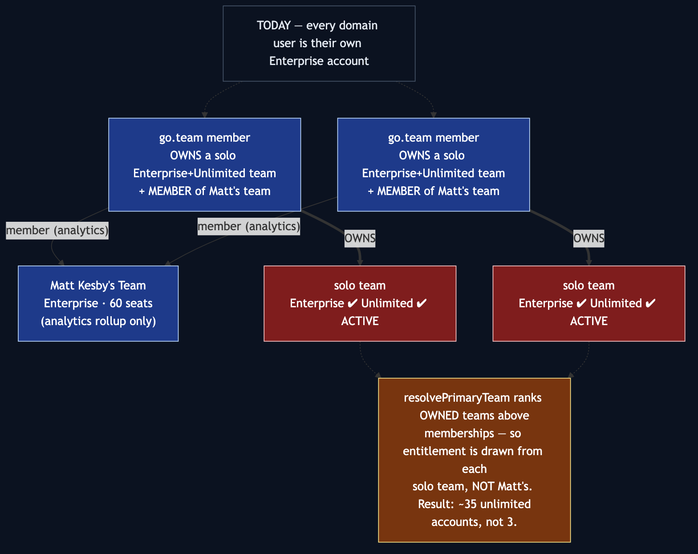
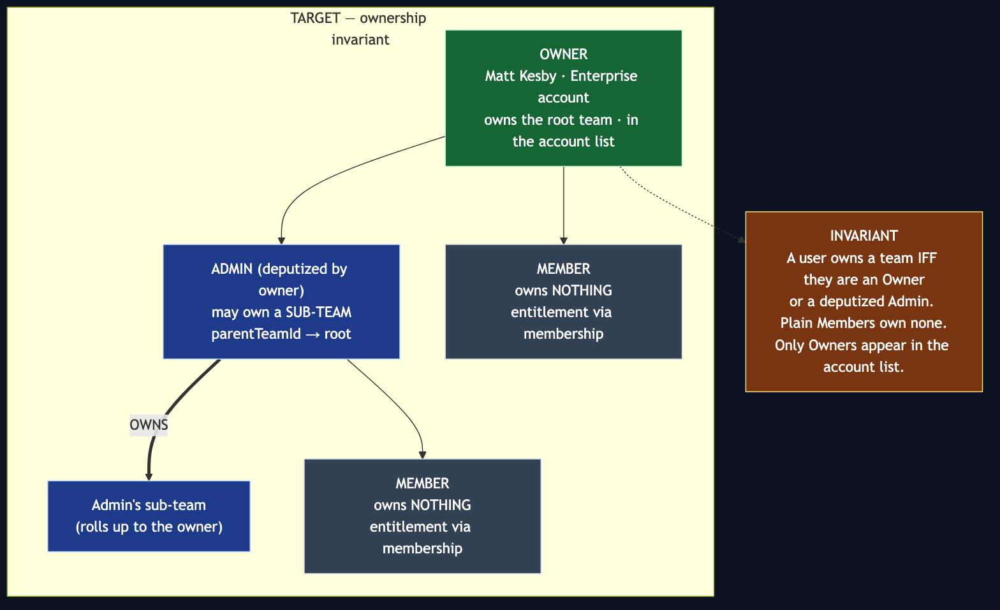
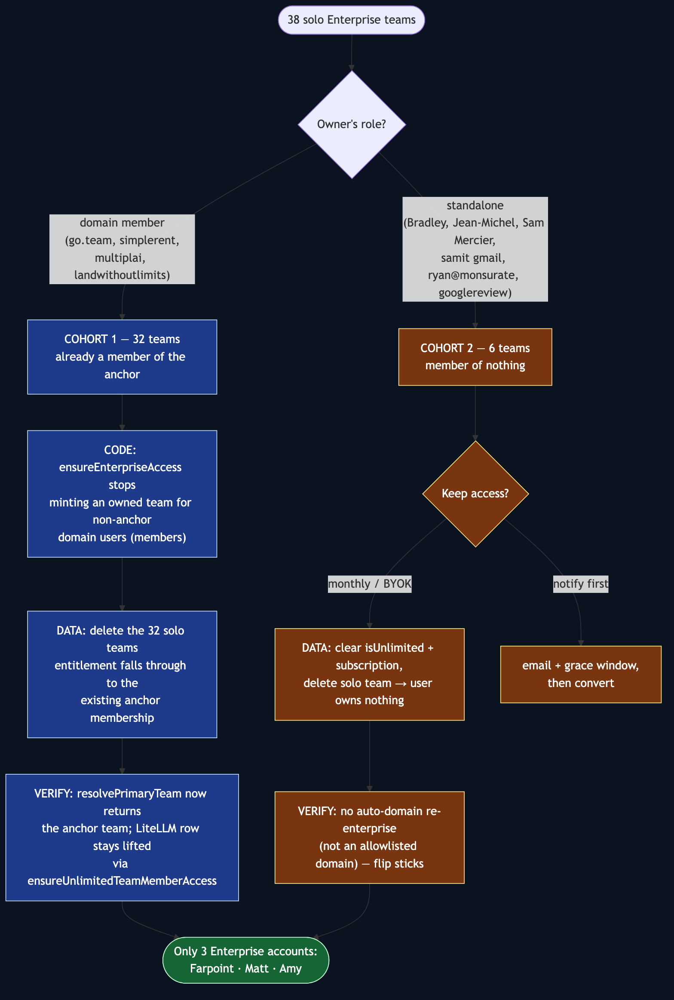

# Enterprise Account Consolidation & the Team-Ownership Invariant

## Summary

The superadmin Enterprise provisioning page (PR #312) exposed a data problem
that had been invisible until something listed every Enterprise team in one
dropdown: **41 teams are flagged `isEnterprise = true`, but only 3 are real
accounts.** The other 38 are single-owner "solo" teams, each a full
unlimited-until-2027 plan, and — because of how entitlement resolves — each is
the *actual billing source* for its owner. So the portal effectively runs ~35
unlimited accounts, not 3.

This plan establishes and enforces one rule Ryan stated directly:

> **Owners** are the only rows in the account list. An owner can deputize
> **Admins**, who may own their own **sub-teams**. **Members** — owners of
> nothing — draw entitlement purely from membership.

Under that rule the 30 go.team members owning their own Enterprise teams *is* the
bug. The work is a small, high-blast-radius **code** change to the entitlement
self-heal plus a **one-time data migration**, ending at exactly three Enterprise
accounts: **Farpoint (Ryan), Matt Kesby, Amy (Land Without Limits).**

## Background — why a flag flip does not work

Two facts, both verified against production (read-only) on 2026-07-23:

**1. Entitlement is drawn from the OWNED team, not the membership.**
`resolvePrimaryTeam` (`src/lib/team-helpers.ts:141`) ranks a user's *owned*
teams first and only falls through to a membership when they own nothing:

```
selectPrimaryTeam(user.ownedTeams) ?? user.teamMembers[0]?.team ?? null
```

Every one of the 38 solo teams is `isEnterprise ✔ isUnlimited ✔
subscriptionStatus = ACTIVE`, period running to 2027. So a go.team member's
entitlement comes from *their own* solo team; Matt's "31/60 seats" is an
analytics rollup only.

**2. The self-heal re-creates them.** `ensureEnterpriseAccess`
(`src/lib/provision-enterprise.ts:62`) runs on every sign-in and status call. For
any address on an auto-enterprise domain (`go.team`, `simplerent.com.au`,
`multiplai.tech`, `landwithoutlimits.com`) it re-flags — or freshly re-creates —
an owned Enterprise team (lines 70–84). **So setting `isEnterprise = false` on a
domain member's team is undone on their next request, possibly minting a new
duplicate.** This is why the fix must be code, not a `UPDATE`.



## Target model



**The invariant:** *a user owns a team **iff** they are an Owner (root account)
or an Admin who has been deputized to run a sub-team. Plain Members own no team.*
The Enterprise account list shows **only Owners** of root accounts. Admin
sub-teams already have first-class support — `Team.parentTeamId` + the hierarchy
walkers in `src/lib/team-auth.ts` (`getAncestorTeams`, `MAX_HIERARCHY_DEPTH`).

## Approach

Two cohorts, established from the data (full worklist in the Appendix):



### Cohort 1 — domain members (32 teams: 28 go.team, 2 simplerent, 1 multiplai, 1 landwithoutlimits)

All 32 owners **are already members of their anchor team** (Matt's or Amy's), so
retiring their solo team drops entitlement straight onto the membership that
already exists — no new rows to write.

1. **Code — `ensureEnterpriseAccess`.** Split "anchor owner" from "domain
   member". For a non-anchor domain user, do **not** create or keep an owned
   Enterprise team; ensure anchor membership + the lifted LiteLLM row, and stop.
   Anchor owners (Matt, Amy) keep the current behaviour.
2. **Data — retire the 32 solo teams.** With the owned team gone,
   `resolvePrimaryTeam` falls through to the anchor membership. Deletion is
   data-safe: **0 `Usage` rows reference any of these teams, and none has a
   sub-team** (verified). LiteLLM access is unaffected —
   `ensureUnlimitedTeamMemberAccess` keeps the row lifted because the user is a
   member of an active-unlimited team (the anchor).
3. **Verify** on samples before and after: `resolvePrimaryTeam` returns the
   anchor team; the user's models allowlist is unchanged.

### Cohort 2 — standalone (6 teams)

Members of nothing, and **not** on an auto-enterprise domain — so once their
solo team is gone they will *not* be re-enterprised, and the change sticks.
Dispositions decided by Ryan on 2026-07-23 (billing/usage verified read-only,
same date):

| User | Disposition | Notes |
|---|---|---|
| **ryan@monsurate.com** | Delete solo team → **add as MEMBER of the Farpoint Enterprise team** (owned by ryan@farpointhq.com) | Ryan's own other-app account; keeps access via Farpoint membership. |
| **samuelalexander.mercier@gmail.com** (Sam Mercier) | Delete solo team → **add as MEMBER of the Farpoint Enterprise team** | Free guest — Canadian-government auditor evaluating the app. Verified low usage (8 requests, $0.00). |
| **samitmhatre6@gmail.com** | **Delete the account** | Samit's personal test account. Trivial history (9 requests, $0.02) cascades away; delete rather than offboard per Ryan. |
| **googlereview@farpointhq.com** | **Delete the account / retire team** | OAuth-review test account, never used (0 requests). |
| **bradley@growthopia.io** (Bradley Rix) | **Not a paying customer.** Free trial **expires 2026-07-25**. Retire the solo team as part of cleanup. | 12 requests, $0.00, dormant since Jul 5. Pending Ryan: let lapse vs. sales reach-out. |
| **jm@jeanmichel.me** (Jean-Michel Moreau) | **Not a paying customer.** Free trial **expires 2026-07-25**. Retire the solo team as part of cleanup. | 73 requests, $0.64, dormant since Jun 26. Pending Ryan: let lapse vs. sales reach-out. |

Note: trial expiry stops *unlimited* but does **not** clear `isEnterprise`, so
Bradley's and Jean-Michel's solo teams must still be deleted to leave the account
list — expiry alone does not clean them up. "Add as MEMBER of Farpoint" reuses
the exact Cohort-1 mechanic: entitlement resolves through the Farpoint Enterprise
team once they own no team of their own.

### Sequencing

Code first (so the self-heal stops fighting the migration), deployed and
verified, **then** the data migration as a separate reviewed script that runs
against production behind the standard `migrate diff` guard. The dropdown becomes
correct as a *consequence* of the data being correct — no cosmetic filter needed,
though a defensive "owner + ≥1 member" filter on `/api/admin/enterprise/accounts`
is cheap insurance and included.

## Files to modify

- `src/lib/provision-enterprise.ts` — `ensureEnterpriseAccess`: distinguish
  anchor owner vs domain member; members get membership + LiteLLM lift, no owned
  team.
- `src/lib/enterprise-domains.ts` — the anchor-owner lookup already exists
  (`ENTERPRISE_ANCHOR_OWNERS`); may need an `isAnchorOwner(email)` helper.
- `src/app/api/admin/enterprise/accounts/route.ts` — defensive filter to
  owner-with-members (real accounts only).
- Possibly `src/lib/team-helpers.ts` — only if we choose the resolution-precedence
  option over deletion (see Open Decisions); default plan does **not** touch it.

## New files

- `scripts/consolidate-enterprise-accounts.ts` — idempotent, `--dry` by default,
  refuses the stale `fabric_billing` DSN (same guard as
  `provision-enterprise-seats.ts`), prints a per-team plan, and only writes with
  `--execute`. Cohort 1 and Cohort 2 gated by separate flags.
- `src/lib/__tests__/ensure-enterprise-access.test.ts` — the invariant, pinned.

## Test strategy

Written before the code, contract-first:

- **Domain member, no owned team → gets anchor membership, owns nothing.** The
  new invariant. Fails against today's code.
- **Domain member with a pre-existing solo team → team retired, membership kept,
  entitlement resolves to anchor.** The migration's post-condition.
- **Anchor owner (Matt) → keeps their owned Enterprise root team.** Guards
  against over-broad declassification.
- **`resolvePrimaryTeam`: member of an unlimited anchor, owns nothing → returns
  the anchor** (already true; pin it so the migration's assumption can't
  regress).
- **Standalone user declassified → not re-enterprised** (non-auto domain).
- **Idempotency:** running the consolidation twice is a no-op the second time.
- **Cascade safety:** deleting a solo team leaves `Usage` rows intact
  (`teamId → null`), removes only the owner-only `TeamMember`/`TeamInvitation`
  rows.

## Risks

- **Blast radius: the entitlement hot path.** `ensureEnterpriseAccess` runs on
  every enterprise sign-in. A regression could strip access org-wide. Mitigation:
  contract tests first, `reconcileEntitlement`'s never-throw guarantee (A4)
  already isolates failures, staged rollout, sample verification on prod.
- **Deletion is irreversible.** Once a solo team is deleted it cannot be un-deleted.
  Mitigation: `--dry` default, full pre-image snapshot of the 38 rows to the
  scratchpad before `--execute`, and the migration touches only teams matching
  the exact worklist (owner-only + `isEnterprise`), never a broad `WHERE`.
- **Cohort 2 access cutoff.** Converting standalone users to monthly removes
  their unlimited access. Mitigation: per-account decision + optional notify +
  grace window before conversion.
- **Shared production database.** All the CLAUDE.md hazards apply — run
  `prisma migrate diff` first; the migration is DML only (no schema change), so
  it does not arm the drift landmine, but the guard still runs.
- **Parallel Claude instances.** The data step is a one-shot script run with
  explicit approval, not an ambient change; no branch switching or schema pushes.

## SOLID analysis

- **S — Single Responsibility.** `ensureEnterpriseAccess` currently does two
  jobs: *provision an account owner* and *attach a domain member*. Splitting
  those (owner path vs member path) is the core of this plan and improves SRP.
  The consolidation script is one-shot and separate from the steady-state code —
  correct, not a permanent responsibility bolted onto a route.
- **O — Open/Closed.** The anchor-owner set lives in `ENTERPRISE_ANCHOR_OWNERS`;
  adding a future Enterprise account is data, not a code change. Preserved.
- **L — Liskov.** `resolvePrimaryTeam` returns a `RankableTeam` union whether the
  source is an owned team or a membership; the migration relies on that
  substitutability holding, so the plan pins it with a test rather than assuming.
- **I — Interface Segregation.** The read-only roster
  (`/accounts`) stays separate from the write stream (`/provision`) — unchanged,
  and the defensive filter lives only on the read side.
- **D — Dependency Inversion.** The script depends on the same `provision-enterprise`
  helpers the app does, not on raw SQL for entitlement — so entitlement logic
  stays in one place and the migration can't drift from runtime behaviour.
  (Team *deletion* is the one raw-Prisma step, because there is no app-level
  "retire team" helper today; if we expect more of these, that helper is the
  clean extraction — noted, not built pre-emptively.)

**Over-engineering check:** the alternative to deleting solo teams is changing
`resolvePrimaryTeam` to rank enterprise *membership* above a non-enterprise owned
team. That avoids deletion but changes the #277-era precedence for **every** user
with more than one team — far larger blast radius for a one-time cleanup. The
plan prefers deletion and flags the trade-off below.

## Open decisions (need Ryan)

1. **Retire mechanism for Cohort 1 — delete vs. change resolution precedence.**
   Recommended: **delete** the 38 owner-only solo teams (data-safe per the
   Appendix; smallest steady-state change). The alternative touches
   `resolvePrimaryTeam` globally. Which?
2. **Cohort 2 — resolved** (see the table above). Remaining sub-question:
   Bradley and Jean-Michel are non-paying trials that expire 2026-07-25 on their
   own — **let them lapse and delete their solo teams as cleanup**, or hold for a
   sales reach-out first? (Default: let lapse; near-zero usage, Ryan doesn't
   know them.)
3. **Should a brand-new individual signup still get a personal team?** The
   invariant as written ("Members own nothing") is scoped here to *inside an
   Enterprise account*. Regular non-enterprise individuals still need a personal
   team for credits/billing to attach. Confirm that scoping so we don't
   accidentally rework the whole signup path.

## Appendix — production worklist (read-only, 2026-07-23)

41 Enterprise teams = 3 real accounts + 38 solo:

| Cohort | Domain | Solo teams | Already on anchor |
|---|---|---:|---:|
| 1 | go.team | 28 | 28 |
| 1 | simplerent.com.au | 2 | 2 |
| 1 | multiplai.tech | 1 | 1 |
| 1 | landwithoutlimits.com | 1 | 1 |
| 2 | gmail.com | 2 | 0 |
| 2 | monsurate.com | 1 | 0 |
| 2 | jeanmichel.me | 1 | 0 |
| 2 | growthopia.io | 1 | 0 |
| 2 | farpointhq.com (googlereview test) | 1 | 0 |

Real accounts kept: **Ryan Monsurate's Team** (Farpoint, 11 seats, uncapped) ·
**Matt Kesby's Team** (31/60) · **Land Without Limits** (3/20).

Cascade safety: **0** `Usage` rows reference the 38 solo teams; **0** have
sub-teams; **1** go.team solo team carries a pending invitation (cascades away
harmlessly).
