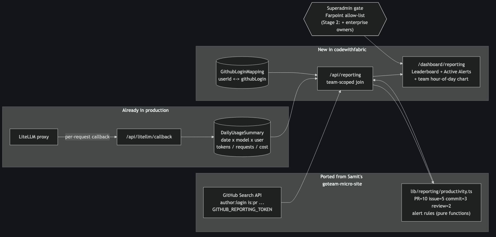
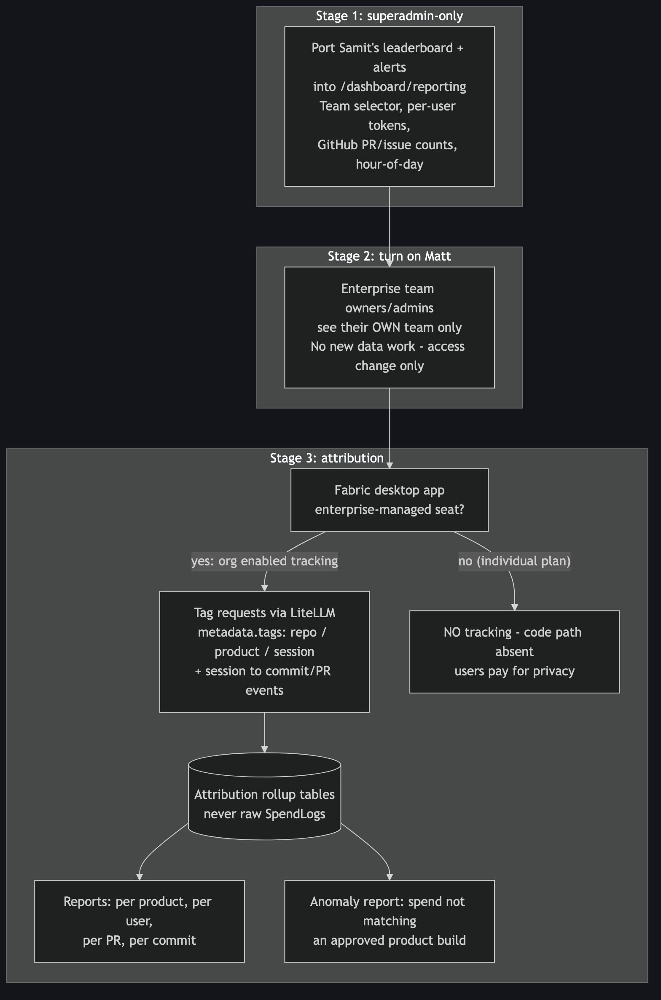

# Enterprise Reporting — Token Usage vs Productivity

**Status:** Draft — awaiting approval
**Date:** 2026-07-23
**Requested by:** Matt Kesby (Multiplai / Go Team), via Slack 2026-07-23
**Repos touched:** `codewithfabric` (Stage 1–2), `Fabric` desktop app (Stage 3)

## Summary

Matt's enterprise reporting ask, verbatim from Slack:

1. Token usage per product
2. Token usage per product, per user
3. Token usage per PR
4. Token usage per commit
5. Token-usage anomaly report — spend **not** associated to an approved product build

Plus time-of-day analysis ("a user sets up a big PR train overnight, reviews and plans during the day"). His closing line: *"if this is not something we can see from Fabric, we would need to build something ourselves around this"* — this is a build-vs-churn feature.

Samit already built a working prototype of the per-user half: **`farpointhq/goteam-micro-site`** (goteam-micro-site.vercel.app) — a productivity leaderboard + Active Alerts screen that joins LiteLLM token usage with GitHub PR/issue counts and scores each developer. Ryan's direction: **Stage 1 ports Samit's work into codewithfabric.com as a new Reporting tab, visible to Farpoint superadmins only.** Enterprise-owner access and true per-PR/commit/product attribution come in later stages.

## Approach

### Stage 1 — port Samit's dashboard into the portal (superadmin-only) ← this plan's build target

New page `/dashboard/reporting`, gated exactly like `/dashboard/analytics` (Farpoint email allow-list), with a **team/domain selector** so a superadmin can view any enterprise team (Go Team, Multiplai, …).

What ports over from `goteam-micro-site`, and what it lands on:

| Samit's piece | Portal equivalent |
|---|---|
| Token usage from his Neon PG | **Already have it**: `DailyUsageSummary` (date × model × userId × userEmail × tokens/requests/cost), populated by the existing LiteLLM callback. Team scoping already proven by `/api/team/analytics`. |
| `src/lib/github/activity.ts` — GitHub Search API counts (`author:<login> is:pr created:<range>` etc.) with a `CLIENT_GITHUB_TOKEN`, 30-min in-memory cache | Port nearly verbatim → `src/lib/reporting/github-activity.ts`; new env `GITHUB_REPORTING_TOKEN`. Note: author-scoped **global** search, not org-scoped — acceptable for Stage 1, flagged in Risks. |
| `src/lib/productivity.ts` — scoring (PR=10, issue=5, commit=3, review=2), output/token ratio, alert generation (`zero_output`, `low_productivity` @ score<25, `high_tokens` @ 1M) | Port → `src/lib/reporting/productivity.ts` as pure functions + config object. |
| User → GitHub-login mapping (his Neon table) | New Prisma model `GithubLoginMapping` (userId ↔ githubLogin) + a small superadmin editor on the Reporting page. Seed with the known Go Team mappings. |
| `ProductivityLeaderboard` + Active Alerts UI | New `src/components/dashboard/reporting-*` components, styled to match the existing Analytics tab. |

Also in Stage 1, cheap because the portal already has the infra: an **hour-of-day usage chart scoped to the selected team, stacked per user** (clone of the existing superadmin hour-of-day chart) — this directly answers Matt's overnight-PR-train question without any client work.

### Stage 2 — open to enterprise team owners

Flip the gate from allow-list-only to `isSuperAdmin(email) || (team.isEnterprise && viewer is team owner/ADMIN)`, each viewer locked to their own team. No new data work — Stage 1 must therefore never leak cross-team data into a response, which the team-selector API design enforces from day one. Ship after Ryan validates the numbers privately with Matt.

### Stage 3 — true attribution via the Fabric desktop app (separate plan when we get there)

Items #1–#4 per-product/PR/commit and #5 (anomaly vs an approved-product registry) cannot be answered honestly from server-side data — only the Fabric client knows which repo/branch/session a request belongs to and which commits/PRs a session produced. Design constraints agreed with Ryan:

- **Enterprise-managed seats only**, enabled org-wide by the company. No privacy expectation on enterprise seats — but **non-enterprise users get zero tracking; the code path must not exist for them.** They are paying for privacy.
- **No customer GitHub access required.** Future enterprise clients never hand us a token: the Fabric client itself is the sensor. It knows the open workspace, the checked-out branch, the commits each session authors, and the moment a PR is created (it drives git/gh) — it reports these as events; we never call the customer's GitHub.
- **Two-level attribution model** (agreed with Ryan 2026-07-23):
    1. *Chat → repo:* every request from any chat in a workspace is tagged with that repo. Per-repo and per-repo-per-user token reports fall out directly.
    2. *Chats → PR:* a PR's cost aggregates **many conversations that predate the PR** — so linkage is by **branch + commit SHAs, never time windows**. Requests carry `repo + branch`; sessions record authored SHAs; when the client reports "PR #N opened from branch B with SHAs […]", PR cost = all tokens tagged that repo+branch plus tokens from sessions that authored the PR's commits. This is precisely what Stage 1's window-join cannot do (tokens burned last week producing a PR pushed today).
    - Accepted limits, stated honestly: exploratory spend that never lands in a PR stays repo-level (that IS the #5 anomaly bucket); a chat about repo A while repo B is open misattributes — workspace is a proxy.
- Attribution rides in the LiteLLM **request-body `metadata.tags`** (repo/branch/session). Custom headers are stripped by LiteLLM before logging, so tags are the only channel that survives to SpendLogs. Session→commit/PR events go to a portal ingestion endpoint.
- Reports read from **rollup tables**, never raw SpendLogs (112 GB before retention work).
- Approved-product registry (team owners register products/repo patterns) → untagged or unregistered spend is the #5 anomaly report.

## Files to Modify (`codewithfabric`)

- `prisma/schema.prisma` — add `GithubLoginMapping` model (additive migration)
- `src/app/dashboard/layout.tsx` — add Reporting nav item behind the same `showAnalytics`-style superadmin check
- `.env.example` / Vercel env — `GITHUB_REPORTING_TOKEN`

## New Files (`codewithfabric`)

- `src/lib/superadmin.ts` — single source for the Farpoint allow-list (currently copy-pasted in 3+ files; new code uses this, migrating old callers is optional cleanup)
- `src/lib/reporting/productivity.ts` — scoring + alert rules (pure, config-driven; ported from Samit)
- `src/lib/reporting/github-activity.ts` — GitHub Search client (ported from Samit)
- `src/app/api/reporting/route.ts` — team-scoped report API: joins `DailyUsageSummary` + GitHub activity + mappings, returns leaderboard + alerts
- `src/app/api/reporting/mappings/route.ts` — CRUD for GitHub-login mappings (superadmin)
- `src/app/dashboard/reporting/page.tsx` — page shell + gate
- `src/components/dashboard/reporting-leaderboard.tsx`, `reporting-alerts.tsx`, `reporting-hour-of-day.tsx`, `reporting-mappings-editor.tsx`

## Test Strategy

Written before implementation, per TDD:

- **`productivity.ts` (pure logic)** — score at boundaries (0 activity, exactly-threshold score 25, huge token counts / overflow-ish values); each alert rule fires exactly at its threshold and not below; alert output stable for identical input (no random IDs breaking snapshots); config overrides respected.
- **`github-activity.ts`** — token missing → zero counts (Samit's behavior, verify preserved); GitHub 4xx/5xx → cached-failure path, no throw to the page; query strings exactly `author:<login> is:pr is:merged merged:<range>` etc. (contract, not implementation).
- **`/api/reporting`** — 403 for non-superadmin (member, enterprise owner, anonymous); team filter never returns another team's users even with a forged teamId param; empty team → empty leaderboard, no 500; date-range snapping matches `DailyUsageSummary` UTC-midnight grain.
- **Mappings CRUD** — superadmin-only writes; duplicate login/user upsert semantics; deletion removes GitHub join but user still appears with token data.
- **UI smoke (Playwright)** — page renders for allow-listed email, redirects otherwise; leaderboard sorts; alerts panel shows CRITICAL/WARNING styling; mobile 375px layout.

## Risks

- **GitHub Search API is author-global, not org-scoped** — a mapped developer's personal-repo PRs count toward "productivity." Acceptable for Stage 1 (Samit's live numbers already work this way and Matt is calibrated to them); Stage 3's client-side attribution fixes it properly.
- **Search API rate limit is 30 req/min** — 5 queries/user × N users can exceed it on cold cache. Mitigate: keep Samit's 30-min cache, add per-request batching/backoff; superadmin-only traffic makes this small in practice.
- **Score interpretation** — a 6/100 score is management-legible in a way raw tokens aren't; once owners see it (Stage 2) the weights become politically load-bearing. Keep weights in a config object, display the formula in the UI footer.
- **Cross-team leakage** — Stage 1 API must be team-scoped even though only superadmins call it, so Stage 2 is a gate flip, not a refactor.
- **Divergence from Samit's site** — two dashboards computing "productivity" differently would confuse Matt. Plan: port his exact thresholds/weights, then deprecate goteam-micro-site once Stage 2 ships.
- **DailyUsageSummary grain** — daily UTC buckets; "after-hours" alerts need hour grain, which Stage 1 gets from the existing hour-of-day query path (raw request rows), not the summary. If that path is too slow team-scoped, defer after-hours alerts to Stage 3 rather than querying LiteLLM's PG.

## SOLID Analysis

- **S — violation found in the prototype, fixed in the port:** Samit's `/api/tokens/route.ts` mixes auth, SQL, GitHub fetching, scoring, and alert assembly in one handler. The port splits data sources (`github-activity`, Prisma queries), domain logic (`productivity.ts`, pure), and HTTP (`/api/reporting`) into separate modules. Also extracts the thrice-duplicated superadmin allow-list into `src/lib/superadmin.ts`.
- **O:** alert rules become an array of `(metrics, config) → Alert | null` functions; Stage 3 adds anomaly/after-hours rules by appending, not editing. Scoring weights/thresholds live in a config object.
- **L:** no inheritance hierarchies involved; n/a.
- **I:** the report API depends on two narrow interfaces — `TokenUsageSource` (today: `DailyUsageSummary`; Stage 3: attribution rollups) and `ActivitySource` (today: GitHub Search; Stage 3: Fabric client telemetry) — so Stage 3 swaps providers without touching UI or scoring.
- **D:** UI components consume the `/api/reporting` response shape only; scoring depends on the interfaces above, not Prisma or fetch. **Trade-off consciously taken:** no plugin registry or DI container — two hand-written interfaces are the right size; anything more is over-engineering for a two-source system.

## Diagrams

