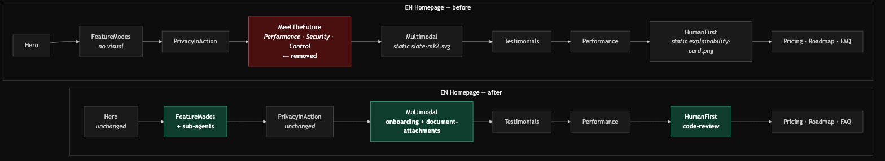
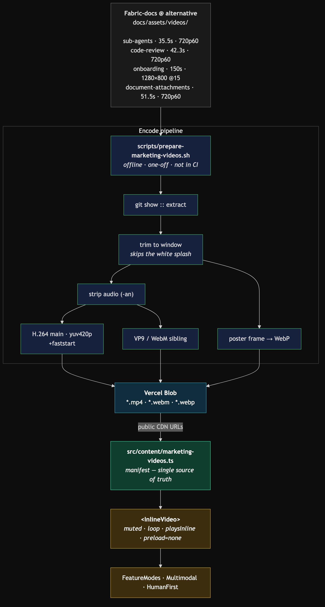
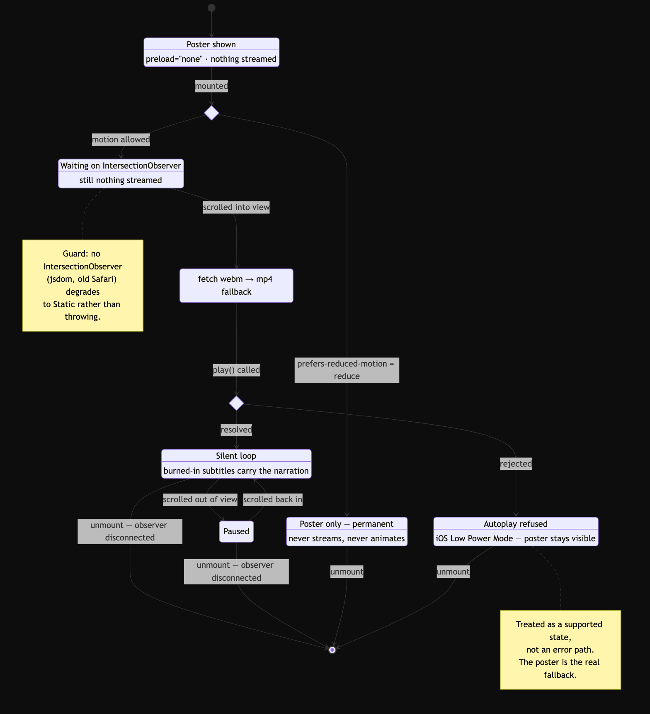

# Homepage Product Video — Implementation Plan

!!! tip "Live mockup"
    **[▶ Open the interactive "after" mockup](homepage-video-mockup/){ target=_blank }** — the real
    encoded clips at the proposed trim windows, playing muted and looping exactly as they would
    ship. Toggle change annotations and a 375px viewport from the controls in the top right.

## Summary

Put real product footage on the EN homepage. Four clips from the Fabric docs video set are
trimmed to short silent loops, hosted on Vercel Blob, and embedded inline in the marketing
sections whose claims they demonstrate. The redundant "Meet the Future of Coding" section is
removed from the EN page at the same time.

**Decisions already made (do not re-litigate):**

| Decision | Choice |
|---|---|
| Placement | Inline in existing feature sections (not a hero swap, not a new section) |
| Clips | `sub-agents`, `code-review`, `onboarding`, `document-attachments` |
| Hosting | Vercel Blob |
| Playback | Muted autoplay loop, trimmed to short excerpts |
| Meet the Future | Removed from EN homepage entirely (JP page keeps it) |

## Source Material — verified, not assumed

The 13 docs videos live on the **`alternative` branch** of `farpointhq/Fabric-docs` under
`docs/assets/videos/` (local `main` is an older structure and has none of them). Every figure
below came from `ffprobe` on the actual files.

| Clip | Duration | Size | Resolution | fps | Audio |
|---|---|---|---|---|---|
| `sub-agents.mp4` | 35.5s | 4.4 MB | 1280×720 | 60 | narration |
| `code-review.mp4` | 42.3s | 4.8 MB | 1280×720 | 60 | narration |
| `onboarding.mp4` | 150.0s | 4.2 MB | 1280×800 | 15 | narration |
| `document-attachments.mp4` | 51.5s | 4.4 MB | 1280×720 | 60 | narration |

Three properties of the source drive the whole design:

1. **All 720p.** These are screen recordings of a dense IDE. Upscaled past ~900 CSS px on a
   retina display the code text goes soft. Every embed below is therefore width-capped.
2. **`sub-agents`, `code-review` and `document-attachments` open on a white "Fabric" splash
   card.** On a black page an untrimmed loop would strobe white once per cycle. Trimming is a
   correctness requirement, not a polish step.
3. **Burned-in subtitles.** Muting costs us nothing — the narration is already on screen as
   text. This is why silent autoplay works here at all.

## Trim Windows

Chosen by scrubbing each clip on a timestamped contact sheet. Windows are candidates to be
frame-checked during implementation; the surrounding beats are recorded so the boundaries can
be nudged without re-deriving them.

| Clip | Window | Len | What the loop shows |
|---|---|---|---|
| `sub-agents` | 12.0s → 26.0s | 14s | Five research agents spin up in parallel, live per-agent cost and token counters tick |
| `code-review` | 5.0s → 20.0s | 15s | `/review` slash command → "six dimensions" callout → findings report |
| `onboarding` | ~46s → ~70s | 24s | Glowing orb, LISTENING ⇄ FABRIC SPEAKING, context cards accumulating |
| `document-attachments` | 13.0s → 27.0s | 14s | Three PDF cards fly in, question asked against all three |

`onboarding` is the outlier and the strongest asset: it is 15fps, has almost no fine text, and
is the only clip that shows **voice**. It survives scaling far better than the IDE captures and
carries the "Voice" third of the Multimodal claim that nothing else in the set covers.

## Approach

### 1. Media pipeline (offline, one-off)

`scripts/prepare-marketing-videos.sh` — extracts each source from the `alternative` branch via
`git show`, then per clip:

- trim to the window with `-ss`/`-to`
- **strip audio** (`-an`) — muted autoplay never needs it, and it is free size
- encode H.264 `main` profile + `yuv420p` (Safari/iOS requirement) with `-movflags +faststart`
- encode a VP9/WebM sibling, offered first for the ~30% saving
- export a poster frame as WebP

Expected output well under 2 MB per clip. The script is idempotent and re-runnable; it is
tooling, not application code, and nothing at runtime depends on it.

### 2. Hosting

`scripts/upload-marketing-videos.ts` pushes the encoded files to Vercel Blob and prints the
public URLs. `@vercel/blob` is a **devDependency and upload-time only** — the site itself just
fetches static CDN URLs, so nothing ships to the client bundle.

Provisioning is a real prerequisite: the project currently has **no Blob store and no
`BLOB_READ_WRITE_TOKEN`** (`vercel env ls production` shows none).

### 3. Manifest

`src/content/marketing-videos.ts` — the single source of truth mapping a clip key to its URLs,
poster, intrinsic dimensions, and accessible description. Components import from here; no blob
URL is ever hardcoded in a component. This mirrors the existing `src/content/pricing-plans.ts`
convention.

### 4. `<InlineVideo>` component

`src/components/marketing/inline-video.tsx`, a client component deliberately scoped to exactly
one job — *an autoplaying silent loop that behaves itself*:

- `muted loop playsInline` + `preload="none"`
- an **IntersectionObserver** starts playback on entering the viewport and pauses on exit, so
  four clips never stream at once
- `prefers-reduced-motion: reduce` → never autoplays, renders the poster
- a fixed `aspect-ratio` box so nothing reflows when the video loads (CLS guard)
- prop shape intentionally mirrors `next/image` (`src`, `width`, `height`, `className`) so it
  drops into the slots currently held by `<Image>` with no surrounding layout change

### 5. Placement

| Section | Change |
|---|---|
| `FeatureModes` | **Add** `sub-agents` below the CTA. Section is currently text-only — heading, paragraph, button, no visual at all — so this fills a bare slot rather than replacing art. Capped at `max-w-[860px]`. |
| `HumanFirst` | **Replace** the static `explainability-card.png` with `code-review`. Same slot, same box, directly evidences the "Explainability" timeline item. |
| `Multimodal` | **Replace** the static `slate-mk2.svg` with a stacked pair — `onboarding` (Voice) above `document-attachments` (Documents) — inside the existing right-hand panel over the pastel backdrop. At half-width each renders ~500 CSS px wide, i.e. *downscaled* from 720p and genuinely sharp. |
| `page.tsx` (EN) | **Remove** `<MeetTheFuture />`. The import stays — the JP page still renders it. |

## Files to Modify

| File | Change |
|---|---|
| `src/app/[locale]/page.tsx` | Drop `<MeetTheFuture />` from the EN tree only |
| `src/components/marketing/home/feature-modes.tsx` | Add `sub-agents` embed |
| `src/components/marketing/home/human-first.tsx` | Swap `explainability-card.png` → `code-review` |
| `src/components/marketing/home/multimodal.tsx` | Swap `slate-mk2.svg` → stacked `onboarding` + `document-attachments` |
| `package.json` | `@vercel/blob` as a devDependency |

## New Files

| File | Purpose |
|---|---|
| `src/components/marketing/inline-video.tsx` | The autoplay-loop primitive |
| `src/content/marketing-videos.ts` | Clip manifest (URLs, posters, dimensions, descriptions) |
| `scripts/prepare-marketing-videos.sh` | Trim + encode + poster generation |
| `scripts/upload-marketing-videos.ts` | Vercel Blob upload |
| `src/components/marketing/__tests__/inline-video.test.tsx` | Component tests |
| `src/content/__tests__/marketing-videos.test.ts` | Manifest invariant tests |

## Test Strategy

Vitest + Testing Library, written before the component. Tests assert the **contract** — what a
visitor and their browser observe — never the internals.

**`InlineVideo` behaviour**

- renders `<video>` with `muted`, `loop`, `playsInline`, `preload="none"`
- emits `<source>` in WebM-then-MP4 order
- does **not** call `play()` while out of view
- calls `play()` on intersect, `pause()` on exit
- `prefers-reduced-motion: reduce` → `play()` never called, poster still rendered
- reserves an aspect-ratio box before load (CLS)
- carries an accessible description

**Failure and boundary paths** — the cases a happy-path-only suite would miss:

- `play()` rejecting (iOS Low Power Mode blocks autoplay outright) must be caught, leaving the
  poster visible rather than an unhandled rejection
- absent `IntersectionObserver` (jsdom, old Safari) must degrade to a visible poster, not throw
- unmount mid-playback must disconnect the observer (leak guard)
- zero/missing dimensions must not produce a collapsed box

**Manifest invariants**

- every entry has an `https://` URL, a non-empty poster, and positive dimensions
- keys referenced by components all exist in the manifest

**Page composition**

- EN homepage does not render "Meet the Future of Coding"
- JP homepage still does — the regression that matters, since one import feeds both

**Manual/E2E**

Playwright at 1440px and 375px: no console errors, no horizontal overflow, posters present
before scroll, playback starts on scroll-in, full-page screenshots at several scroll positions.

## Risks

| Risk | Severity | Mitigation |
|---|---|---|
| **720p upscaling looks soft** | High — it is the whole reason to be careful | Every embed width-capped; the Multimodal pair renders *below* native width. Verified visually on the preview before merge. |
| **iOS blocks autoplay** (Low Power Mode) | Medium | `muted` + `playsInline` satisfy the normal policy; Low Power Mode ignores it regardless, so the poster is treated as the real fallback and must look deliberate. |
| **Four clips × bandwidth** | Medium | `preload="none"` + IntersectionObserver; audio stripped; WebM offered first. Nothing loads until scrolled to. |
| **Layout shift on load** | Medium | Fixed aspect-ratio box, asserted in tests. |
| **Blob store not provisioned** | Blocker | Must be created before implementation; there is no store and no token today. |
| **Losing SOC 2 / air-gapped / RBAC copy** | Accepted | Removing `MeetTheFuture` drops the homepage's only compliance mention. Ryan chose this knowingly; the claims remain on `/enterprise`. |
| **Source branch drift** | Low | Clips are copied to Blob, not hot-linked, so a `Fabric-docs` restructure cannot break the homepage. |

## SOLID Analysis

**Single Responsibility** — four separate concerns, four separate artifacts: the manifest holds
data, `InlineVideo` handles presentation, the shell script handles encoding, the TS script
handles upload. The earlier draft had the component owning its own URLs, which fused data and
presentation and would have forced a component edit for every asset change.

**Open/Closed** — adding a fifth clip is a manifest entry plus one JSX line. No existing
component is modified to extend the set.

**Liskov** — `InlineVideo` is a drop-in for the `<Image>` calls it replaces in `HumanFirst` and
`Multimodal`: same `src`/`width`/`height`/`className` contract, same box behaviour. A reviewer
can swap either direction without touching the surrounding layout.

**Interface Segregation** — the component exposes only what an autoplay loop needs. It has
deliberately **no** `controls`, `autoPlay`, `muted`, or `onPlay` props. A caller cannot ask for
sound or a scrubber, because the moment one of those is wanted the honest answer is a different
component, not another flag on this one.

**Dependency Inversion** — sections depend on the manifest abstraction and never on Vercel Blob.
Re-hosting elsewhere is a one-file change and touches no component or test.

### Trade-offs consciously accepted

- **No general `<VideoPlayer>`.** A player with controls, audio, captions and chapters would be
  the "extensible" choice and would be over-engineering for four decorative loops. If narrated
  click-to-play is ever wanted, that is a genuinely different component with a different
  contract — building it now would mean carrying an unused abstraction indefinitely.
- **Encoding stays a manual script, not CI.** These are one-off marketing assets. Wiring ffmpeg
  into the build would slow every deploy to serve a workflow that runs approximately never.
- **The manifest is a typed constant, not a CMS.** Consistent with `pricing-plans.ts`. A CMS
  would add a network dependency to a static marketing page for no editorial benefit at this
  volume.
