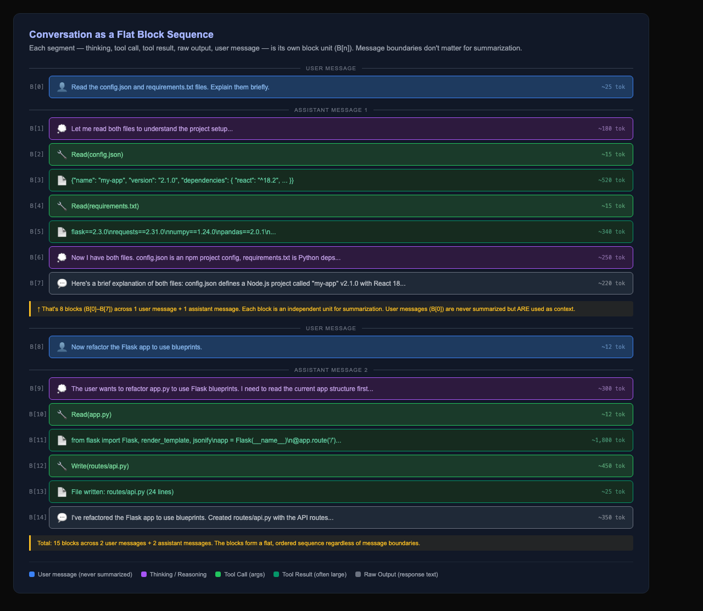
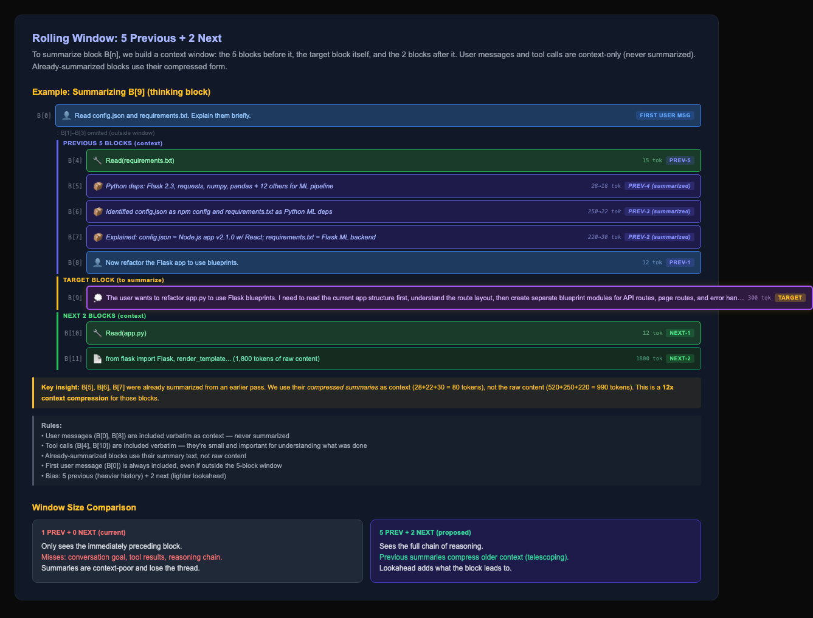
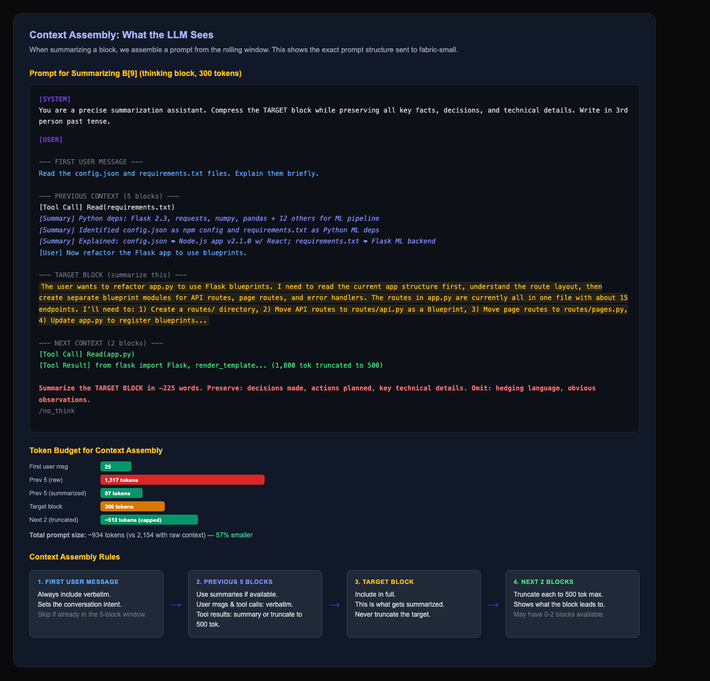
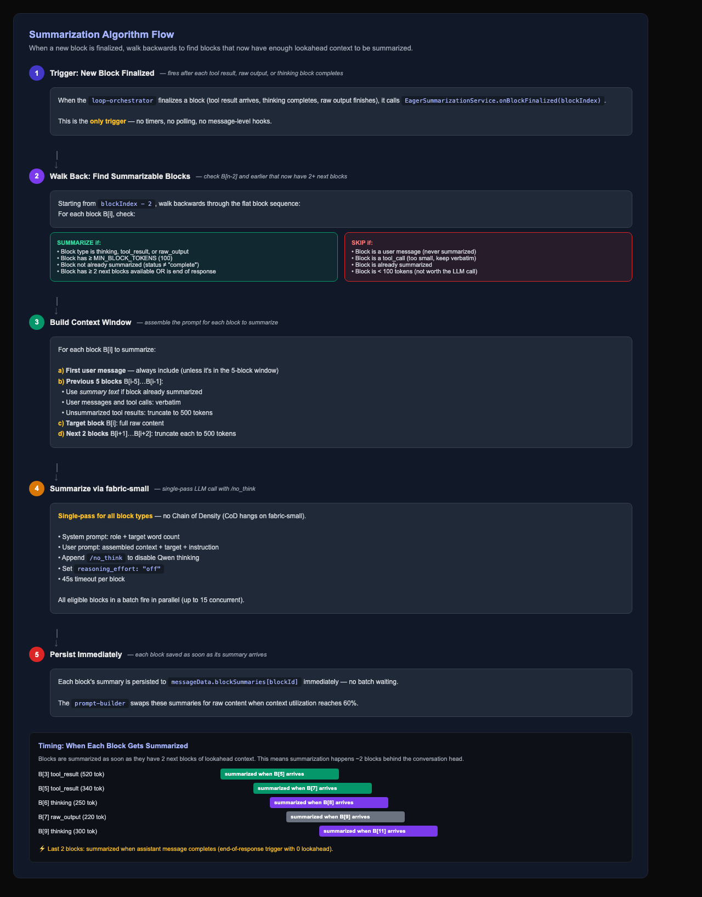

# Issue #1810 — Block-Level Eager Summarization Algorithm

## Summary

Replace the current message-level summarization with a **segment-level rolling window** algorithm. Every segment in the conversation (thinking, tool result, raw output) is an independent unit ("block") that gets summarized using surrounding blocks as context. The window operates across message boundaries — assistant messages and user messages are just containers, the blocks inside them are what matters.

**Goal:** The user should never have to click "Compact." Context management happens invisibly through eager block summarization.

## The Flat Block Sequence

A conversation is a flat, ordered sequence of blocks that crosses message boundaries:

Each block is independently summarizable. User messages and tool calls are context-only (never summarized themselves, but used as context for summarizing adjacent blocks).

## Rolling Window: 5 Previous + 2 Next

To summarize a block, we build a context window biased toward the past — the 5 blocks before it and the 2 blocks after it. Already-summarized blocks use their compressed form, creating a **telescoping compression** effect.

Key design decisions:
- **5 previous + 2 next** — heavy past bias. A block's meaning comes from what led to it.
- **Telescoping** — older blocks are doubly-compressed (summary of summary), giving cheap history.
- **First user message always included** — sets conversation intent, included as preamble when outside the window.
- **User messages & tool calls verbatim** — they're small and important context; never summarized.

## Context Assembly

The exact prompt structure sent to fabric-small for each block:

## Algorithm Flow

The step-by-step process — when to trigger, what context to build, how to summarize:

## Live Simulator

Open the interactive simulator to explore the algorithm visually and test with real LLM calls:

**[Open Simulator](./issue-1810-simulator.html)**

The simulator lets you:
- See the flat block sequence with color-coded block types
- Click any block to see its rolling window context highlighted
- View the exact prompt that would be sent to fabric-small
- Run summarization (with real LLM calls or mock fallback)
- Adjust window size (prev/next) and see the effect
- Track compression stats in real-time

## Key Changes from Current Implementation

| Aspect | Current | Proposed |
|--------|---------|----------|
| **Unit** | Assistant message | Individual segment (block) |
| **Window** | Previous 1 assistant message | Previous 5 blocks + next 2 blocks |
| **Cross-message** | No — each message summarized in isolation | Yes — window spans message boundaries |
| **Context reuse** | Raw content always | Summarized blocks used as compressed context |
| **Strategy** | CoD for reasoning/output, single-pass for tools | Single-pass for all (CoD hangs on fabric-small) |
| **Trigger** | After assistant message completes | After each block finalizes (2-block delay for lookahead) |
| **First user msg** | Not included | Always included as intent context |

## Files to Modify

| File | Change |
|------|--------|
| `eager-summarization.service.ts` | Rewrite to operate on flat block sequence with rolling window |
| `loop-orchestrator.ts` | Fire `onBlockFinalized()` per-block instead of per-message |
| `summarization-prompt.ts` | New prompt builder that assembles rolling window context |

## Open Questions

1. **Window size tuning** — Is 5+2 right? The simulator can help test different sizes.
2. **CoD vs single-pass** — CoD hangs on fabric-small (Qwen 3.5). Should we try single-pass for all block types?
3. **End-of-response blocks** — Last 2 blocks won't have 2 next blocks. Summarize with 0-1 lookahead?
4. **Token cap on next-block context** — Should next blocks be truncated to 500 tokens each?

## SOLID Analysis

- **S (Single Responsibility):** Each block is independently summarizable — no coupling between blocks.
- **O (Open/Closed):** Window size is configurable (PREV_WINDOW, NEXT_WINDOW constants). New block types can be added without changing the algorithm.
- **L (Liskov):** All block types share the same interface (`SummarizableBlock`).
- **I (Interface Segregation):** The prompt builder only needs `content`, `tokens`, and `summary` — doesn't depend on message-level metadata.
- **D (Dependency Inversion):** Summarization depends on `promptLLM` abstraction, not a specific model.

## Risk Assessment

1. **Performance:** 5+2 window means more context per LLM call. But with summarized blocks, the actual token count is lower (57% smaller in the diagram example).
2. **Ordering:** Summarization runs 2 blocks behind the conversation head. If the user sends a new message while summarization is running, the window for older blocks is already computed — no conflict.
3. **fabric-small reliability:** CoD hangs. Single-pass works reliably (~15s per block). We should use single-pass for all block types until CoD is fixed.
