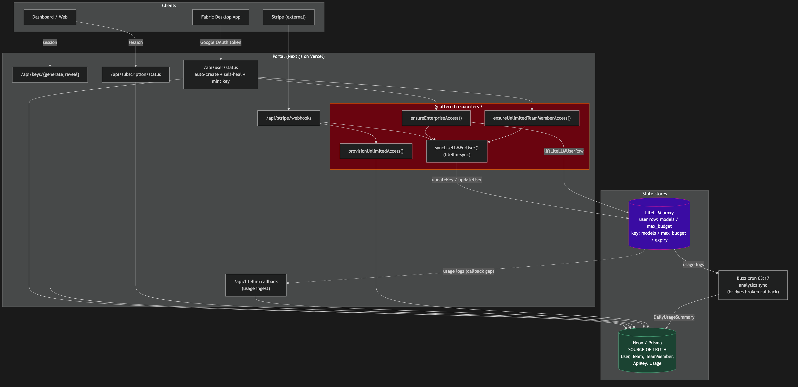
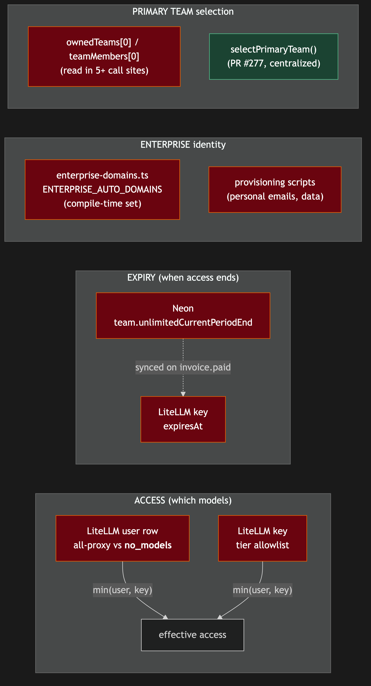

# Issue #278: Architecture review + refactor — auth / sign-up / API key / billing lifecycle

## Summary

Conduct a top-to-bottom architectural review of the account lifecycle — **authentication & sign-up → API key creation/verification → billing/entitlement** — produce diagrams of the *real* flows, write down the invariants and sources-of-truth, and ship a prioritized refactor backlog. **No behavior changes land in this issue.** Output is documentation, diagrams, and scoped follow-up PRs. Catalyst: PR #277 (shadow-team entitlement bug).

This is a **review + design** deliverable. The implementation work is *producing the artifacts below*, not changing application code.

## Root Cause Analysis (why this issue exists)

PR #277 fixed a symptom: a proactively-provisioned Enterprise user got a **shadow team** on first OAuth sign-in, and entitlement resolved via an unordered `ownedTeams[0]`, silently stripping their plan. The codebase exploration for this plan confirms the *disease* is **accidental complexity accreted across incidents**:

1. **The `ownedTeams[0]` / `teamMembers[0]` "primary team" assumption is duplicated in 5+ readers** — `dashboard/page.tsx`, `api/user/status`, `team-helpers.findUserTeamId`, `litellm-sync`, `api/keys/generate` — each defending against multi-team independently. PR #277 added `selectPrimaryTeam` but did not retrofit every reader. The schema does not prevent a user owning >1 team.
2. **Dual sources of truth with manual reconciliation.** Access lives in BOTH the LiteLLM user row (`all-proxy-models` vs `__no_models__`) and the per-key tier allowlist (`min(user,key)`). Expiry lives in BOTH Neon (`team.unlimitedCurrentPeriodEnd`) and the LiteLLM key `expiresAt`. "Is this enterprise" is answered by BOTH a compile-time `ENTERPRISE_AUTO_DOMAINS` set and data-driven provisioning scripts.
3. **Self-heal logic scattered across hot paths.** `ensureEnterpriseAccess`, `ensureUnlimitedTeamMemberAccess`, and the inline key-mint in `/api/user/status` all reconcile entitlement on the request path, with overlapping responsibilities.
4. **A known callback gap** (LiteLLM → Neon usage) is bridged by an out-of-band Buzz cron at 03:17, not by code in this repo.

```
Current architecture — portal ↔ Neon ↔ LiteLLM ↔ Buzz cron, with the scattered reconcilers highlighted:
```


```
The "two sources of truth" map — every place state is duplicated and where drift can occur:
```


## Proposed Solution (approach)

Work in four review tracks, producing one set of artifacts. Each track maps to a subsystem already scoped in the issue. Reviewers should **read the code, not the comments** — confirm each invariant against the actual implementation before writing it down.

1. **Auth & sign-up track** — NextAuth v5 (`src/lib/auth.ts`), the custom adapter + `getUserByEmail`/`findUserByNormalizedEmail` override, `allowDangerousEmailAccountLinking`, `events.createUser` team bootstrap, credentials/email-password flow, beta gate, staff/team auth, and the `User/Account/Session/VerificationToken/PasswordResetToken/BetaInvite` models.
2. **API key track** — `/api/user/status` (token verify → auto-create → ensure access → mint/return), `/api/keys/{generate,reveal}`, `provision-enterprise.ts`, `provision-unlimited.ts`, `litellm.ts`, `litellm-sync.ts`, the `__no_models__` / `all-proxy-models` sentinels, `min(user,key)` enforcement, and `crypto.ts` (AES-256-GCM).
3. **Billing & entitlement track** — Stripe `checkout`/`checkout-onetime`/`portal`/`webhooks`, `billing.ts` (`getAllowedModelsForContext` as the single access predicate), `enterprise.ts` (`shapeSubscriptionStatus`), `balance.ts`, team helpers/hierarchy/auth, usage/`DailyUsageSummary`, and the dual-expiry model.
4. **Cross-cutting synthesis** — produce the diagrams, the architecture doc, the prioritized refactor backlog, and the security/entitlement checklist; assert no regressions for each proposed change.

For each track: produce the relevant diagram source (`.mmd`), render to PNG, document the flow + invariants + source-of-truth, and append findings to the backlog.

## Files to Review (no code changes in this issue)

| Area | Files | What to capture |
|------|-------|-----------------|
| Auth core | `src/lib/auth.ts`, `src/lib/userLookup.ts`, `src/lib/emailUtils.ts` | JWT session, adapter override, account-linking safety, normalization |
| Email/password | `src/app/api/auth/{signup,verify-email,forgot-password,reset-password,resend-verification,clear-stale}`, `src/lib/{password,email,tokens}.ts` | Token lifetimes, single-use, session invalidation, signup team-bootstrap duplication |
| Beta / staff | `src/lib/beta-config.ts`, `src/lib/beta-gate.ts`, `src/app/api/beta/*`, `src/lib/{staff-auth,team-auth}.ts` | 4-point beta gate, RBAC matrix |
| API key | `src/app/api/user/status/route.ts`, `src/app/api/keys/{generate,reveal}/route.ts` | Auth modes, self-heal branches, P2002 race handling |
| Provisioning | `src/lib/provision-enterprise.ts`, `src/lib/provision-unlimited.ts` | `ensureEnterpriseAccess`, `ensureUnlimitedTeamMemberAccess`, `ensureFabricApiKey`, `liftLiteLLMUserRow` idempotency |
| LiteLLM | `src/lib/litellm.ts`, `src/lib/litellm-sync.ts`, `src/app/api/litellm/callback/route.ts` | `min(user,key)`, sentinels, spend-reset reasons, cost fallback |
| Crypto | `src/lib/crypto.ts` | AES-256-GCM, per-key IV, reveal authz, `API_KEY_ENCRYPTION_SECRET` |
| Stripe/billing | `src/app/api/stripe/**`, `src/lib/{stripe,billing,balance,enterprise}.ts`, `src/content/pricing-plans.ts` | Webhook events, enterprise guards, tier/model allowlists, dual expiry |
| Teams | `src/lib/{team-helpers,team-hierarchy,team-invite,team-emails}.ts`, `src/app/api/team/**` | `selectPrimaryTeam`, owner-vs-member, `[0]` readers |
| Enterprise | `src/lib/enterprise-domains.ts`, proactive provisioning scripts | Compile-time domains vs data-driven scripts |
| Schema | `prisma/schema.prisma` | All 14 models + relations (User↔Team ownership vs membership) |

## New Files (the deliverables)

| File | Purpose |
|------|---------|
| `docs/plans/issue-278-architecture.md` (in main repo) | Written architecture doc: each flow, invariants, source-of-truth per state |
| `docs/plans/issue-278-*.mmd` + `.png` | The 7 diagrams below (`.mmd` source → PNG, images only in markdown) |
| `docs/plans/issue-278-refactor-backlog.md` | Prioritized (impact × risk) refactor items, each scoped to its own PR |
| `docs/plans/issue-278-security-checklist.md` | Entitlement/security guarantees asserted preserved by each proposed change |

> Note: the issue's deliverables live in the **main `codewithfabric` repo** under `docs/plans/`, per repo convention — distinct from this planning artifact in the `-plans` repo.

## Deliverable Diagrams (7)

1. **Sequence** — desktop sign-in → `/api/user/status` → key mint/return, incl. self-heal branches
2. **Sequence** — web sign-up (OAuth + credentials) → email verify → team bootstrap → key generate
3. **Sequence** — Stripe checkout → webhook → entitlement / LiteLLM sync
4. **State machine** — a Team's billing/entitlement states (INACTIVE / ACTIVE / Unlimited / Enterprise / expired) + transitions
5. **State machine** — an ApiKey + its LiteLLM user-row state (deny-all `__no_models__` → lifted; key tier allowlist)
6. **ERD** — account/billing models and relations (esp. User↔Team ownership vs membership)
7. **Component/data-flow** — portal ↔ Neon ↔ LiteLLM proxy ↔ Buzz analytics cron (the "two sources of truth" map)

## Implementation Steps

1. Land the architecture doc skeleton in `docs/plans/issue-278-architecture.md` with one section per flow.
2. Author the 7 `.mmd` diagrams, render to PNG, embed images only.
3. Per track, verify each invariant against the code and fill the source-of-truth table.
4. Compile findings into the prioritized refactor backlog (seeded below), each item scoped to a standalone PR.
5. Write the security/entitlement checklist asserting no regression for each proposed refactor.
6. Open the doc PR; each refactor item becomes its own scoped, individually-reviewed PR afterward.

## Seed Refactor Backlog (expand during review)

Prioritized by impact × risk. Each item is scoped to become its own PR.

| # | Item | Impact | Risk | Notes |
|---|------|--------|------|-------|
| 1 | **Single primary-team predicate.** Retrofit all `ownedTeams[0]`/`teamMembers[0]` readers (dashboard, `/api/user/status`, `findUserTeamId`, `litellm-sync`, `keys/generate`) to `selectPrimaryTeam`. Then decide: enforce ≤1 owned team in the data model, or make multi-team first-class. | High | Med | Direct continuation of #277; eliminates the bug class entirely. |
| 2 | **One idempotent `reconcileEntitlement(userId)`.** Collapse `ensureEnterpriseAccess` + `ensureUnlimitedTeamMemberAccess` + the inline key-mint into a single idempotent function; make it the only entitlement self-heal entry point. | High | Med | Removes overlapping hot-path logic; easier to test once. |
| 3 | **Single LiteLLM writer.** Make `litellm-sync` the *only* code that writes to LiteLLM (key + user row); have provisioning call it rather than calling `litellm.updateKey/updateUser` directly. | High | Med | Closes drift between Neon and LiteLLM; one place to reason about `min(user,key)`. |
| 4 | **Enterprise identity as one data-sourced predicate.** Replace the compile-time `ENTERPRISE_AUTO_DOMAINS` set + script-provisioned personal emails with a single "is this account enterprise" predicate sourced from data. | Med | Med | Removes two code paths that can disagree. |
| 5 | **Close the LiteLLM callback gap in code.** Document and, separately, replace/standardize the Buzz cron bridge with an in-repo reconciler or a hardened callback. | Med | Med | Currently out-of-band; a TOCTOU/observability gap. |
| 6 | **De-duplicate signup team bootstrap.** `events.createUser` and the signup route both bootstrap a team (signup bypasses the adapter). Extract one shared bootstrap helper. | Med | Low | Two divergent copies of the same logic. |
| 7 | **Confirm + lint the access gate.** Assert the access gate is the models allowlist (never `max_budget`) everywhere; flag any code treating budget as an access gate. | Med | Low | Per prior corrections (Ryan, twice). |
| 8 | **Test coverage for cross-system reconcile + webhooks.** Add tests for invariants surfaced by the diagrams (reconcile paths, webhook replay/ordering). | Med | Low | Fills the gaps the review exposes. |

## Test Strategy

This issue produces **no behavior changes**, so there is no application code to unit-test here. Verification of the *deliverable*:

- **Diagram fidelity:** each diagram cross-checked against the actual code paths it depicts (the exploration in this plan is the baseline).
- **Invariant assertions:** every "source of truth" claim in the architecture doc is backed by a file:line reference.
- **Backlog scoping check:** each backlog item is independently shippable (no item requires another to land first, or the dependency is stated).
- **Security checklist:** each proposed refactor is paired with the guarantee(s) it must preserve and how to verify them.
- For the *follow-up* refactor PRs (out of scope here): TDD per the repo workflow, with tests written before the refactor, plus `npm run typecheck` and `npm run build`.

## Risks & Mitigations

| Risk | Mitigation |
|------|------------|
| Review documents the *intended* design, not the *actual* one (comment drift) | Read code, not comments; back every invariant with a file:line citation. |
| A refactor silently weakens an entitlement guarantee | Security/entitlement checklist gates every backlog item; "err on the side of access" for enterprise (Go.team etc.) is a hard rule — see `provision-enterprise.ts`. |
| Diagrams go stale immediately after merge | Keep `.mmd` sources in-repo so they regenerate; reference them from the doc, not inline. |
| Scope creep — refactors sneak into the review PR | Hard constraint: this issue ships docs/diagrams/backlog only. Refactors are separate, individually-reviewed PRs. |
| "Single owned team" enforcement breaks an existing multi-team user | Audit production data for any user with >1 owned team before enforcing; prefer making multi-team first-class if any exist. |

## Constraints (from the issue)

- **Preserve all functionality and every security/entitlement guarantee.** "Err on the side of access" for enterprise accounts is a hard business rule.
- Refactor for elegance/clarity, not novelty — prefer collapsing scattered/duplicated logic and making invariants explicit over rewrites.
- Diagrams follow the repo convention: separate `.mmd` → PNG, images only in markdown.
- No behavior changes in this issue; refactors land as separate PRs.
