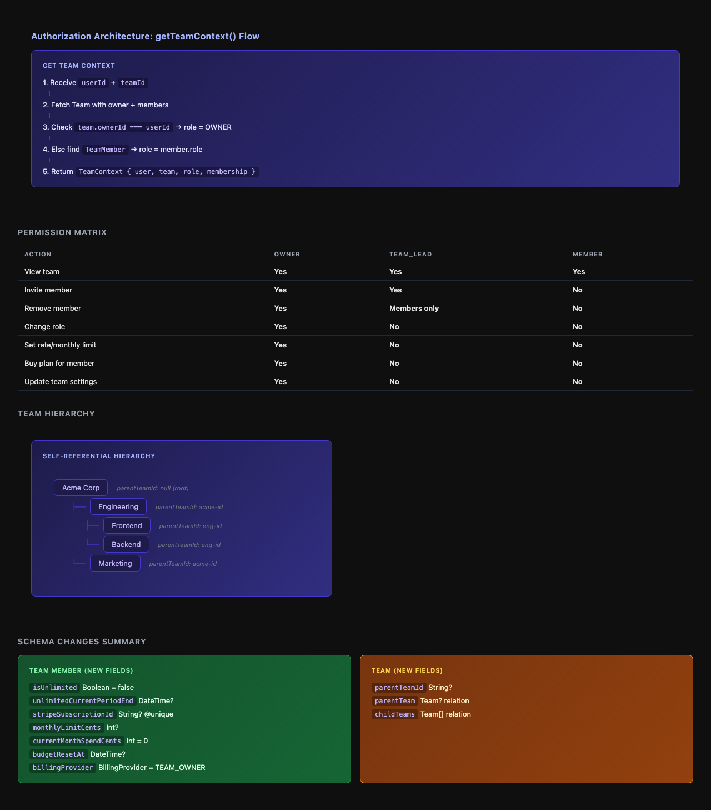

# Issue #64 — Team Management: Schema, Auth & Migration Foundation

## Issue Summary

Add the database schema and authorization foundation for hierarchical team management with per-seat billing. This is a foundational issue — it sets up the data model and permission layer that future team features will build on.

**Key deliverables:**

1. Prisma schema changes (TeamMember billing fields + Team hierarchy)
2. Authorization layer (`src/lib/team-auth.ts`)
3. Unit tests (`src/lib/__tests__/team-auth.test.ts`)

## Proposed Solution

### 1. Schema Changes

#### TeamMember Additions

New fields on the `TeamMember` model for per-member billing:

| Field | Type | Default | Purpose |
|-------|------|---------|---------|
| `isUnlimited` | Boolean | false | Per-member unlimited subscription |
| `unlimitedCurrentPeriodEnd` | DateTime? | null | Subscription period end |
| `stripeSubscriptionId` | String? (unique) | null | Member's own Stripe sub |
| `monthlyLimitCents` | Int? | null | Credit pool spending limit |
| `currentMonthSpendCents` | Int | 0 | Running monthly total |
| `budgetResetAt` | DateTime? | null | Auto-reset monthly spend |
| `billingProvider` | BillingProvider | TEAM_OWNER | Who pays for this member |

New enum:

```prisma
enum BillingProvider {
  SELF        // Member pays for themselves
  TEAM_OWNER  // Team owner pays
}
```

#### Team Hierarchy

New self-referential FK on `Team`:

| Field | Type | Purpose |
|-------|------|---------|
| `parentTeamId` | String? | FK to parent Team (null = root team) |
| `parentTeam` | Team? | Relation to parent |
| `childTeams` | Team[] | Relation to children |

#### Non-Breaking Guarantees

- `Team.isUnlimited` stays (owner's own unlimited status)
- `Team.balanceCents` stays (shared credit pool)
- All new fields are optional or have defaults
- No existing columns modified or removed

### 2. Authorization Layer (`src/lib/team-auth.ts`)



#### TeamContext

```typescript
type TeamRole = 'OWNER' | 'TEAM_LEAD' | 'MEMBER';

interface TeamContext {
  user: { id: string; email: string };
  team: Team;
  role: TeamRole;
  membership: TeamMember | null; // null if owner
}
```

Note: `OWNER` is derived from `Team.ownerId === user.id`, not from `TeamRole` enum (which stays as ADMIN | MEMBER).

#### Permission Matrix

| Action | OWNER | TEAM_LEAD | MEMBER |
|--------|-------|-----------|--------|
| View team | Yes | Yes | Yes |
| Invite member | Yes | Yes | No |
| Remove member | Yes | Yes* | No |
| Change role | Yes | No | No |
| Set rate/monthly limit | Yes | No | No |
| Buy plan for member | Yes | No | No |
| Update team settings | Yes | No | No |

*TEAM_LEAD can only remove MEMBER-level users

#### Hierarchy Helpers

- `getAncestorTeams(teamId)` — walk up `parentTeamId` chain
- `isAncestorOf(teamA, teamB)` — check if A is above B in hierarchy
- Foundational only — full property inheritance comes in a later issue

## Files to Modify

| File | Change |
|------|--------|
| `prisma/schema.prisma` | Add TeamMember billing fields, BillingProvider enum, Team hierarchy |
| `.env.example` | Fix DATABASE_URL comment |

## New Files

| File | Purpose |
|------|---------|
| `src/lib/team-auth.ts` | Authorization functions (getTeamContext, checkPermission, hierarchy helpers) |
| `src/lib/__tests__/team-auth.test.ts` | Unit tests covering permission matrix |

## Test Strategy

### Unit Tests (Vitest)

Following existing test patterns (mock Prisma, test functions in isolation):

1. **getTeamContext()** tests:
   - Owner identified correctly (via `Team.ownerId`)
   - Team lead identified correctly (via `TeamMember.role`)
   - Member identified correctly
   - Non-member returns null/throws
   - User not found returns null/throws

2. **Permission matrix** tests:
   - Each action × each role (7 actions × 3 roles = 21 test cases)
   - TEAM_LEAD removing TEAM_LEAD (should fail)
   - TEAM_LEAD removing MEMBER (should succeed)

3. **Hierarchy helpers** tests:
   - `getAncestorTeams`: single parent, multi-level chain, root team (no parent)
   - `isAncestorOf`: direct parent, grandparent, unrelated teams, same team
   - Circular reference protection (max depth guard)

### Schema Verification

- `npx prisma db push` succeeds
- `npm run typecheck` passes
- Generated Prisma client has correct types

## SOLID Analysis

### Single Responsibility
- `team-auth.ts` has one job: team authorization and context resolution
- Schema changes are purely data model — no behavior

### Open/Closed
- Permission checks use a permission matrix pattern, extensible by adding new actions without modifying existing checks
- `TeamRole` type union (`'OWNER' | 'ADMIN' | 'MEMBER'`) is extensible

### Interface Segregation
- `TeamContext` is minimal — only what callers need
- Hierarchy helpers are separate functions, not baked into `getTeamContext`

### Dependency Inversion
- `team-auth.ts` accepts Prisma client as parameter (for testability)
- No direct imports of global prisma instance in the auth logic

### Trade-offs
- Not adding a full RBAC framework — overkill for 3 roles
- Permission matrix is a simple function, not a class hierarchy — appropriate given scope

## Risks

1. **Schema migration on production** — All fields are optional/defaulted, so `prisma db push` should be safe. No data migration needed.
2. **Circular team hierarchy** — `getAncestorTeams` needs a max depth guard to prevent infinite loops if data gets corrupted.
3. **OWNER role not in enum** — OWNER is derived from `Team.ownerId`, not stored in `TeamRole`. This is by design (owner is a relation, not a role assignment), but callers need to understand this.

## Acceptance Criteria

- [ ] Schema pushes cleanly with `npx prisma db push`
- [ ] `getTeamContext()` correctly identifies owner vs member vs non-member
- [ ] Permission checks pass for all matrix combinations
- [ ] `getAncestorTeams()` walks the parent chain correctly
- [ ] Unit tests cover the permission matrix
- [ ] `npm run typecheck` passes
