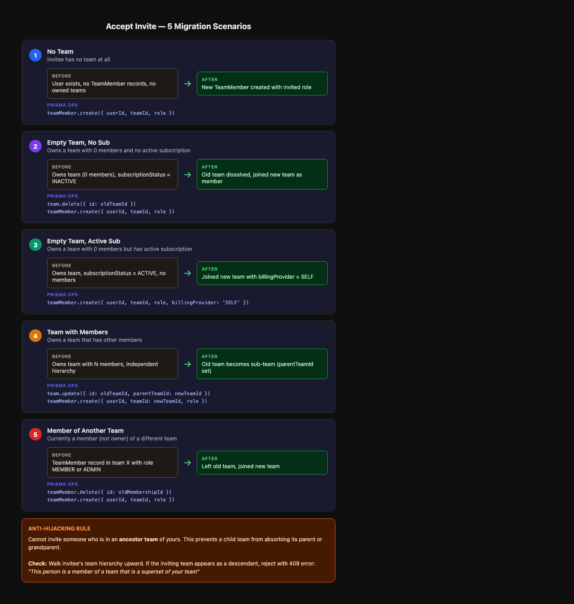

# Issue #65 — Team Invite Flow & Team Migration

## Summary

Build the complete team invitation lifecycle: send invite → accept with smart migration → notification emails. This is the core UX that unblocks team onboarding.

## Root Cause / Context

Issue #64 laid the foundation (schema, auth, hierarchy helpers). Now we need the API routes and business logic that actually make team invitations work.

## Architecture


## Accept Logic — 5 Scenarios



The accept endpoint must handle 5 invitee states:

| # | Invitee State | Behavior |
|---|--------------|----------|
| 1 | No team | Create `TeamMember` |
| 2 | Owns empty team, no active sub | Dissolve their team, join yours |
| 3 | Owns empty team, has active sub | Join yours with `billingProvider: SELF` |
| 4 | Owns team with members | Their team becomes sub-team (`parentTeamId`) |
| 5 | Member of another team (not owner) | Leave old team, join new |

**Anti-hijacking rule:** Cannot invite someone who is in an ancestor team of yours (prevents circular hierarchy).

## API Routes

### POST `/api/team/invite`
1. Auth + `getTeamContext()` → `checkPermission('INVITE_MEMBER')`
2. Validate & normalize email
3. Check anti-hijacking: if invitee owns a team that is an ancestor of the inviting team, reject
4. Check for duplicate pending invite to same email
5. Create `TeamInvitation` with 7-day expiry and secure token
6. Send invite email via Resend
7. Return 201

### GET `/api/team/invitations`
1. Auth + `getTeamContext()` → `checkPermission('INVITE_MEMBER')`
2. Auto-expire past-due invitations (bulk update `PENDING` → `EXPIRED` where `expiresAt < now`)
3. Return list with email, role, status, dates

### POST `/api/team/invitations/[token]/accept`
1. Auth required (user must be signed in)
2. Validate token: exists, `PENDING`, not expired, email matches signed-in user
3. Determine invitee's current state (5 scenarios)
4. Execute appropriate migration in `prisma.$transaction`
5. If user has no API key, generate one via LiteLLM
6. Mark invitation as `ACCEPTED`
7. Send "invite accepted" email to team owner
8. Return team info

### POST `/api/team/invitations/[token]/revoke`
1. Auth + `getTeamContext()` → `checkPermission('INVITE_MEMBER')`
2. Validate token exists and belongs to this team
3. Update status to `REVOKED`
4. Return 200

## Schema Changes

The `TeamInvitation` model from issue #64 needs two additions:

```prisma
model TeamInvitation {
  // ... existing fields ...

  // Add relation to Team
  team Team @relation(fields: [teamId], references: [id], onDelete: Cascade)

  // Add inviter tracking
  invitedById String?
}
```

And `Team` needs the inverse relation:

```prisma
model Team {
  // ... existing fields ...
  invitations TeamInvitation[]
}
```

## Files

### New
| File | Purpose |
|------|---------|
| `src/app/api/team/invite/route.ts` | POST — send invitation |
| `src/app/api/team/invitations/route.ts` | GET — list invitations |
| `src/app/api/team/invitations/[token]/accept/route.ts` | POST — accept invitation |
| `src/app/api/team/invitations/[token]/revoke/route.ts` | POST — revoke invitation |
| `src/lib/team-emails.ts` | Invite + accepted email templates |
| `src/lib/__tests__/team-invite.test.ts` | Unit tests for invite logic |

### Modified
| File | Change |
|------|--------|
| `prisma/schema.prisma` | Add `team` relation + `invitedById` to TeamInvitation |

## Core Business Logic — `src/lib/team-invite.ts`

Extract the accept logic into a testable module (not buried in the route handler):

```typescript
// Pure logic functions, easily testable
export function determineInviteeState(invitee: InviteeInfo): InviteeState
export async function executeTeamMigration(prisma, state, invitation): Promise<MigrationResult>
export async function checkAntiHijacking(prisma, inviterTeamId, inviteeEmail): Promise<boolean>
```

This keeps routes thin (auth + validation + delegate) and business logic testable.

## Email Templates (`src/lib/team-emails.ts`)

Following the `beta-emails.ts` pattern with `getResendClient()`:

1. **Team Invite** — "{name} invited you to join {team} on Fabric" + accept link button
2. **Invite Accepted** — "{name} has joined your team" (notify owner)

Both use the same HTML template style: system fonts, 480px max, #1e3a5f primary, fallback URL.

## Test Strategy

### Unit Tests (`src/lib/__tests__/team-invite.test.ts`)
- `determineInviteeState()` — all 5 scenarios with mock data
- `checkAntiHijacking()` — ancestor detection, unrelated teams, same team
- Migration execution — verify correct Prisma operations for each scenario
- Edge cases: expired tokens, already-accepted, revoked, email mismatch

### Route Tests (if time permits)
- Auth failures (401, 403)
- Duplicate invite prevention
- Concurrent accept race condition

## Risks

1. **Schema migration** — Adding relations to TeamInvitation requires a Prisma migration. Low risk since we're adding a relation to an existing column.
2. **Sub-team conversion (Scenario 4)** — Most complex scenario. Must preserve existing member relationships when setting `parentTeamId`. Need to be careful not to create circular hierarchies.
3. **Race conditions on accept** — Two users with the same invite token shouldn't both succeed. Using `prisma.$transaction` with a status check handles this.
4. **Email delivery** — Resend can fail silently. Invite creation should succeed even if email fails (user can resend).

## SOLID Analysis

### Single Responsibility
- **Route handlers**: Only do auth + validation + response formatting
- **`team-invite.ts`**: Contains all invitation business logic
- **`team-emails.ts`**: Only email sending

### Open/Closed
- The 5 migration scenarios are implemented as a state machine pattern. New scenarios can be added by adding a new state + handler without modifying existing ones.

### Interface Segregation
- Routes depend on specific functions (`createInvitation`, `acceptInvitation`), not a monolithic service class.

### Dependency Inversion
- Business logic functions accept `PrismaClient` as a parameter (following `team-auth.ts` pattern), making them testable with mocks.

### Trade-offs
- Not using a full Strategy/Command pattern for migration scenarios — it would be over-engineered for 5 known cases. A simple switch/if-else is clearer and more maintainable at this scale.
