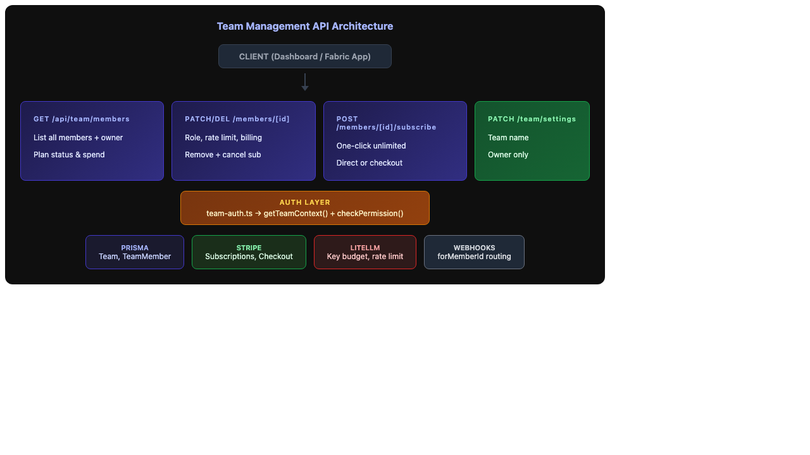
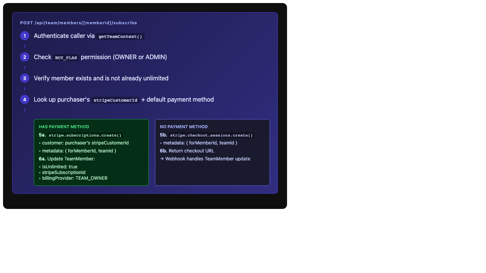
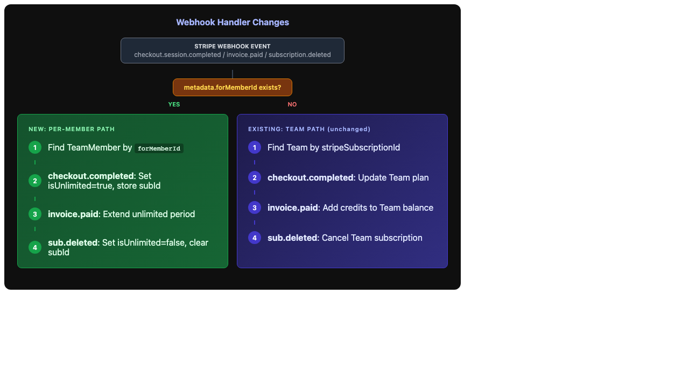

# Issue #66 – Team Management: Member CRUD & Per-Seat Purchasing

## Issue Summary

Build member management API routes and per-seat unlimited purchasing with Stripe. This includes listing members with their plan status, updating member settings (role, rate limits, billing), removing members (with sub cancellation), and a one-click flow for owners/admins to buy unlimited subscriptions on behalf of members.

## Root Cause Analysis

No API routes exist for team management despite the full Prisma schema (`Team`, `TeamMember`, `TeamInvitation`) and auth infrastructure (`team-auth.ts`) being in place from issue #64. The Stripe webhook handler also doesn't handle per-member subscription metadata.

## Proposed Solution

### Architecture Overview



Four new API route files, one webhook modification:

| Route | Methods | Purpose |
|-------|---------|---------|
| `/api/team/members` | GET | List all members with plan status |
| `/api/team/members/[memberId]` | PATCH, DELETE | Update or remove a member |
| `/api/team/members/[memberId]/subscribe` | POST | Buy unlimited for a member |
| `/api/team/settings` | PATCH | Update team name |

### API Design

#### GET `/api/team/members`

Returns the team owner as a synthetic "OWNER" entry plus all `TeamMember` records.

```typescript
// Response shape
{
  members: [{
    id: string,           // TeamMember.id (or "owner" for synthetic)
    userId: string,
    email: string,
    name: string | null,
    role: "OWNER" | "ADMIN" | "MEMBER",
    isUnlimited: boolean,
    billingProvider: "SELF" | "TEAM_OWNER",
    monthlyLimitCents: number | null,
    currentMonthSpendCents: number,
    rateLimitRpm: number,
    hasActiveSubscription: boolean,
    joinedAt: string,     // TeamMember.createdAt or team.createdAt for owner
  }]
}
```

**Auth**: Any team member (VIEW_TEAM permission).

#### PATCH `/api/team/members/[memberId]`

Updates member settings. Different fields require different permission levels:

| Field | Who Can Change | Notes |
|-------|---------------|-------|
| `role` | OWNER only | CHANGE_ROLE permission |
| `rateLimitRpm` | OWNER, ADMIN | SET_BILLING permission |
| `monthlyLimitCents` | OWNER, ADMIN | SET_BILLING permission |
| `billingProvider` | OWNER only | SET_BILLING + special handling |

**Billing provider change flow:**


When switching `billingProvider`:
- **SELF → TEAM_OWNER**: Cancel member's self-paid subscription, create new sub on owner's Stripe customer with `forMemberId` metadata
- **TEAM_OWNER → SELF**: Cancel owner-paid subscription, member must purchase their own

Syncs `rateLimitRpm` to LiteLLM when rate limit changes.

#### DELETE `/api/team/members/[memberId]`

Removes a member from the team:

1. Check REMOVE_MEMBER permission (OWNER can remove anyone, ADMIN can remove MEMBER only)
2. Cannot remove self (the owner)
3. Cancel member's Stripe subscription if they have one
4. Deactivate API key: `isActive: false`, LiteLLM `maxBudget: 0`
5. Delete `TeamMember` record

#### POST `/api/team/members/[memberId]/subscribe`

One-click unlimited purchase flow:



1. Verify BUY_PLAN permission (OWNER or ADMIN)
2. Look up purchaser's Stripe customer
3. **If purchaser has default payment method** → Create subscription directly via `stripe.subscriptions.create()` with metadata `{ forMemberId, teamId }`
4. **If no payment method** → Create Checkout Session with same metadata, return checkout URL
5. On success (direct or via webhook), update `TeamMember.isUnlimited`, `stripeSubscriptionId`

#### PATCH `/api/team/settings`

Owner-only endpoint to update team name.

### Webhook Changes



Modify `src/app/api/stripe/webhooks/route.ts` to check for `forMemberId` in subscription metadata:

- **`checkout.session.completed`**: If `forMemberId` present → update `TeamMember` (not `Team`)
- **`invoice.paid`**: If subscription has `forMemberId` → extend member's unlimited period
- **`customer.subscription.deleted`**: If it's a member sub → set `TeamMember.isUnlimited = false`

### Downline Billing

ADMIN can manage billing for members in their direct team AND all descendant teams. Uses `getDownlineMembers()` from `team-auth.ts` to determine scope. The PATCH and subscribe endpoints check if the target member is within the caller's downline.

## Files to Modify

### New Files
| File | Purpose |
|------|---------|
| `src/app/api/team/members/route.ts` | GET members list |
| `src/app/api/team/members/[memberId]/route.ts` | PATCH/DELETE member |
| `src/app/api/team/members/[memberId]/subscribe/route.ts` | Per-seat subscribe |
| `src/app/api/team/settings/route.ts` | Team settings |
| `src/app/api/team/members/__tests__/route.test.ts` | Tests for GET members |
| `src/app/api/team/members/[memberId]/__tests__/route.test.ts` | Tests for PATCH/DELETE |
| `src/app/api/team/members/[memberId]/subscribe/__tests__/route.test.ts` | Tests for subscribe |
| `src/app/api/team/settings/__tests__/route.test.ts` | Tests for settings |

### Modified Files
| File | Change |
|------|--------|
| `src/app/api/stripe/webhooks/route.ts` | Handle `forMemberId` metadata for per-seat subs |
| `src/app/api/stripe/webhooks/__tests__/route.test.ts` | Tests for per-seat webhook handling |

## Test Strategy

### Unit Tests (TDD - written first)

**GET `/api/team/members`:**
- Returns owner as synthetic OWNER entry
- Returns all TeamMembers with correct plan status
- Non-member gets 403
- Includes `billingProvider` and spend data

**PATCH `/api/team/members/[memberId]`:**
- Role change: OWNER can change, ADMIN cannot
- Rate limit change: OWNER and ADMIN can change
- Monthly limit change: OWNER and ADMIN can change
- Billing provider change: only OWNER
- SELF→TEAM_OWNER: cancels member sub, creates owner sub
- TEAM_OWNER→SELF: cancels owner sub
- Syncs rate limit to LiteLLM
- 404 for non-existent member
- 403 for unauthorized caller

**DELETE `/api/team/members/[memberId]`:**
- OWNER can remove MEMBER
- OWNER can remove ADMIN
- ADMIN can remove MEMBER
- ADMIN cannot remove ADMIN
- Cannot remove self (owner)
- Cancels Stripe subscription
- Deactivates API key + LiteLLM budget
- Deletes TeamMember record
- 404 for non-existent member

**POST `/api/team/members/[memberId]/subscribe`:**
- Creates subscription directly when payment method exists
- Returns checkout URL when no payment method
- Updates TeamMember on direct creation
- 403 for unauthorized caller
- 400 if member already unlimited

**PATCH `/api/team/settings`:**
- OWNER can update name
- ADMIN cannot update
- MEMBER cannot update
- Empty name rejected

**Webhook changes:**
- `checkout.session.completed` with `forMemberId` updates TeamMember
- `invoice.paid` with member sub extends period
- `subscription.deleted` for member sub clears unlimited flag
- Existing team-level handling unchanged

### Adversarial Testing
- Concurrent subscribe requests for same member
- Removing a member mid-subscription-creation
- Changing billing provider when no Stripe customer exists
- Rate limit sync failure (LiteLLM down)
- Invalid memberId formats
- Cross-team access attempts

## Risks

| Risk | Mitigation |
|------|------------|
| Race condition on concurrent subscribe | Use Prisma transactions, check `isUnlimited` before creating sub |
| Orphaned Stripe subscriptions on member removal | Cancel sub before deleting record, log failures |
| LiteLLM sync failures on rate limit change | Fire-and-forget with error logging; key still works with old limit |
| Billing provider switch leaves gap | Transaction: cancel old + create new atomically |
| Downline scope changes during request | Re-check scope at write time, not just read time |

## SOLID Analysis

### Single Responsibility ✅
Each route file handles one resource concern. Auth logic is delegated to `team-auth.ts`. Stripe logic uses the existing `stripe.ts` client. LiteLLM sync uses `litellm.ts`.

### Open/Closed ✅
New routes extend the API without modifying existing route handlers. The webhook handler uses a metadata check that's additive (existing flow untouched when `forMemberId` is absent).

### Liskov Substitution ✅
The synthetic OWNER entry in the members list follows the same shape as real members, so the frontend can treat all entries uniformly.

### Interface Segregation ✅
Each endpoint has a focused request/response contract. The PATCH endpoint accepts partial updates — only provided fields are changed.

### Dependency Inversion ⚠️ Minor
Route handlers directly import `prisma` and `stripe` singletons rather than receiving them as parameters. This matches the existing codebase pattern (all other routes do this) and is acceptable for Next.js API routes where DI adds complexity without benefit. The `team-auth.ts` module already uses DI (takes prisma as parameter) which we leverage.

**Trade-off accepted**: Keeping consistency with existing route patterns is more valuable than introducing a DI framework for API routes.
