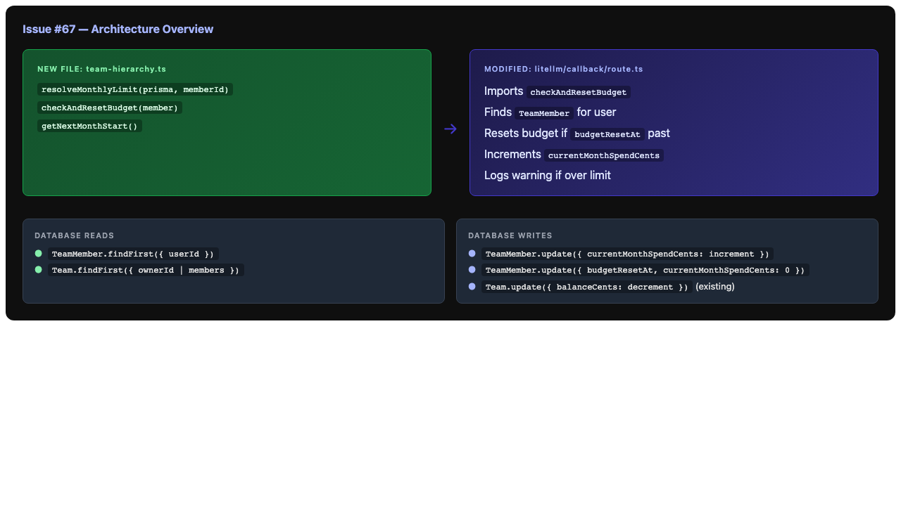

# Issue #67 – Hierarchical Teams & Property Inheritance

**Issue**: [#67 – Team Management: Hierarchical Teams & Property Inheritance](https://github.com/farpointhq/codewithfabric/issues/67)

## Issue Summary

Implement property inheritance through the team hierarchy and budget enforcement in the LiteLLM usage callback. This builds on the hierarchy infrastructure (parentTeamId, ancestor/descendant traversal, anti-hijacking) already delivered in issues #64–66.

## What's Already Done (Issues #64–66)

| Feature | Status | Location |
|---------|--------|----------|
| `parentTeamId` self-referential relation | Done | `prisma/schema.prisma` |
| `getAncestorTeams`, `getDescendantTeams` | Done | `src/lib/team-auth.ts` |
| `checkAntiHijacking` | Done | `src/lib/team-invite.ts` |
| Sub-team absorption on invite accept | Done | `src/lib/team-invite.ts` (`OWNS_TEAM_WITH_MEMBERS` case) |
| Budget fields on TeamMember (`monthlyLimitCents`, `currentMonthSpendCents`, `budgetResetAt`) | Done | `prisma/schema.prisma` |
| Member CRUD with budget field editing | Done | `src/app/api/team/members/[memberId]/route.ts` |

## What Needs to Be Built

### 1. Property Inheritance Engine (`resolveProperty`)

**New file:** `src/lib/team-hierarchy.ts`

A function that resolves a cascading property for a member by walking the team hierarchy:

```
resolveProperty(memberId, propertyName):
  1. Get the member's direct team
  2. Build the ancestor chain: [root, ..., parent, directTeam]
  3. Walk from ROOT → down toward the member's team
  4. At each level, check if the property is set on the team's settings
  5. Return the first value found (root wins)
  6. If nothing found, return null (use system default)
```

**Properties that cascade:**

| Property | Type | Default if unset |
|----------|------|-----------------|
| `rateLimitRpm` | `number` | 0 (unlimited) |
| `monthlyLimitCents` | `number \| null` | null (no limit) |

**Why per-member overrides win:** The member's TeamMember record can have its own `rateLimitRpm` or `monthlyLimitCents`. If set, it overrides the inherited value. This allows team owners to give specific members different limits.

```
Resolution order:
1. Member's own TeamMember field (if set) → use it
2. Walk hierarchy root-to-leaf → first team-level value found
3. System default
```

**Note:** Team-level properties don't exist in the schema yet. For now, properties are set per-member via the TeamMember model. The hierarchy resolution will look at the **member's direct settings first**, then walk up to find any team-level defaults set by ancestor team owners on their own members. This means:

- Each TeamMember can have `monthlyLimitCents` set directly
- If a member doesn't have it set, we look at what the parent team's owner has configured as defaults
- For MVP, we'll resolve from the member record directly and add team-level property cascading when team settings are expanded

**Simplified approach for MVP:**

```typescript
async function resolveMonthlyLimit(
  prisma: PrismaClient,
  memberId: string
): Promise<number | null> {
  const member = await prisma.teamMember.findUnique({
    where: { id: memberId },
    include: { team: true },
  });
  if (!member) return null;

  // Member has explicit limit set → use it
  if (member.monthlyLimitCents !== null) {
    return member.monthlyLimitCents;
  }

  // No limit set → no cap (team balance is the only constraint)
  return null;
}
```

### 2. Budget Enforcement in LiteLLM Callback

**Modified file:** `src/app/api/litellm/callback/route.ts`

The current callback records usage and decrements team balance but does NOT:
- Check per-member monthly limits
- Track per-member spend
- Reset monthly counters

**New flow:**


```
On usage event:
  1. Find user's TeamMember record
  2. If no member record → just decrement team balance (owner usage)
  3. Check budgetResetAt → if past due, reset currentMonthSpendCents = 0
  4. Check monthlyLimitCents:
     - If null → no cap, skip
     - If set AND currentMonthSpendCents + costCents > limit → log warning
  5. Increment member.currentMonthSpendCents by costCents
  6. Set budgetResetAt if not set (first usage)
  7. Continue with existing team balance decrement
```

**Important design decision:** The LiteLLM callback is a **post-hoc** webhook — it fires AFTER the request has already been processed. We cannot reject requests here. Budget enforcement for blocking happens at the LiteLLM proxy level via `max_budget`. Our callback tracks spend for dashboard visibility and alerts.

### 3. Monthly Budget Reset

Embedded in the callback flow (step 3 above). No separate cron job needed.

```typescript
function checkAndResetBudget(member: TeamMember): {
  needsReset: boolean;
  nextResetAt: Date;
} {
  if (!member.budgetResetAt) {
    // First usage — set reset to start of next month
    return { needsReset: false, nextResetAt: getNextMonthStart() };
  }

  if (new Date() >= member.budgetResetAt) {
    return { needsReset: true, nextResetAt: getNextMonthStart() };
  }

  return { needsReset: false, nextResetAt: member.budgetResetAt };
}
```

## Architecture



## Files to Modify

| File | Change |
|------|--------|
| `src/lib/team-hierarchy.ts` | **NEW** — `resolveMonthlyLimit()`, `checkAndResetBudget()`, `getNextMonthStart()` |
| `src/app/api/litellm/callback/route.ts` | Add member lookup, budget tracking, monthly reset |
| `src/lib/__tests__/team-hierarchy.test.ts` | **NEW** — Tests for property resolution and budget reset |

## Test Strategy

### Unit Tests (`src/lib/__tests__/team-hierarchy.test.ts`)

1. **resolveMonthlyLimit**
   - Member with explicit limit → returns that limit
   - Member with null limit → returns null
   - Member not found → returns null

2. **checkAndResetBudget**
   - First usage (no budgetResetAt) → sets next month start
   - Budget reset not due → no reset
   - Budget reset overdue → resets spend to 0
   - Budget reset exactly at boundary → resets

3. **getNextMonthStart**
   - Regular month → first of next month UTC
   - December → January next year
   - Leap year February → March 1

### Integration Tests (LiteLLM callback)

4. **Budget tracking in callback**
   - Usage increments member's `currentMonthSpendCents`
   - Usage for team owner (no member record) → skips member tracking
   - Budget reset triggers when `budgetResetAt` is past
   - Warning logged when member exceeds monthly limit

## Risks

| Risk | Mitigation |
|------|------------|
| Callback is post-hoc (can't block requests) | Documented as tracking-only; blocking happens at LiteLLM proxy level |
| Race condition on spend increment | Use Prisma atomic `increment` operation |
| Budget reset timing | Use UTC-based month boundaries; reset on first usage after period |
| Team hierarchy queries add latency to callback | Single additional query (findFirst for member); hierarchy walk deferred to future |

## SOLID Analysis

### Single Responsibility
- `team-hierarchy.ts` handles property resolution and budget reset logic — focused on hierarchy-aware property computation
- Callback route remains focused on recording usage, with budget tracking added as a cohesive concern

### Open/Closed
- `resolveMonthlyLimit()` is designed to be replaceable with a hierarchy-walking version when team-level settings are added, without changing the callback
- `checkAndResetBudget()` is a pure function that can be extended with different reset periods

### Interface Segregation
- Minimal interfaces: callback only needs `resolveMonthlyLimit()` and `checkAndResetBudget()`
- No bloated "team service" object

### Dependency Inversion
- Functions take PrismaClient as parameter (injectable)
- No direct imports of database connection
