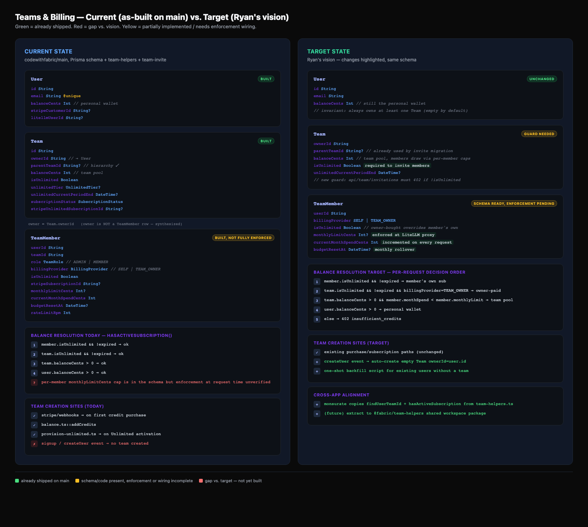
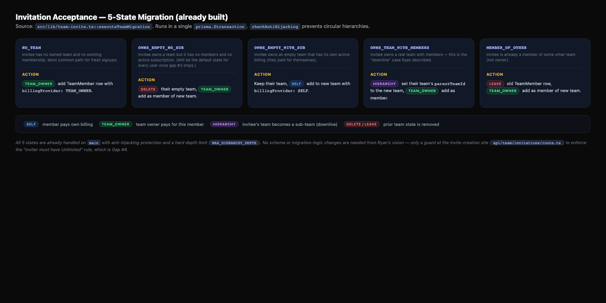

# Teams & Billing Architecture — Current vs. Target

> Written 2026-04-13 from Ryan's verbal vision during the monsurate.com remix-unblock session. This plan documents **where we are, where we want to be, and which gaps are worth closing now vs. later.** No implementation happens until Ryan signs off on direction.

## TL;DR

codewithfabric **already has** most of the teams architecture Ryan described:

- ✅ `Team` with hierarchy (`parentTeamId`, anti-hijacking check, `MAX_HIERARCHY_DEPTH`)
- ✅ `TeamMember` with per-member knobs: `isUnlimited`, `monthlyLimitCents`, `currentMonthSpendCents`, `budgetResetAt`, `rateLimitRpm`, `billingProvider` (`SELF` | `TEAM_OWNER`), per-member `stripeSubscriptionId`
- ✅ Separate `User.balanceCents` and `Team.balanceCents` — independent wallets
- ✅ 5-state invitation migration with downline support (`OWNS_TEAM_WITH_MEMBERS` → becomes sub-team)
- ✅ Per-member subscribe/unsubscribe/settings routes; dashboard, analytics, invitations

Four meaningful **gaps** between the code today and the vision:

1. **No empty team on signup.** Teams are created lazily at first purchase. Users without a purchase have no team at all, which contradicts "everyone has a team, even if it's just themselves".
2. **No "team owner must have Unlimited" guard.** Any user can invite members today as long as they have *some* billing (balance or Unlimited). The vision: you can't create/invite unless you have an Unlimited plan.
3. **monsurate.com `billing.ts` is out of sync with the canonical pattern.** It iterates `user.teamMembers` only, so owner-only teams (i.e. *every* Fabric Unlimited user, including Ryan and Mena) are treated as having no credits. Immediate bug blocking remix for every Unlimited user on monsurate.
4. **No shared helper between the two Next.js apps.** codewithfabric's `team-helpers.ts`/`team-auth.ts` are duplicated informally by monsurate, which is how gap #3 drifted in the first place.

## The picture





## Current State (as-built on `main`)

### Data model

| Model | Fields that matter for billing | Purpose |
|-------|-------------------------------|---------|
| `User` | `balanceCents`, `stripeCustomerId`, `litellmUserId` | Individual wallet, independent of any team. |
| `Team` | `ownerId`, `parentTeamId`, `balanceCents`, `isUnlimited`, `unlimitedTier`, `unlimitedCurrentPeriodEnd`, `subscriptionStatus` | Shared pool + owner-paid subscription container. |
| `TeamMember` | `userId`, `teamId`, `role`, `billingProvider` (`SELF`/`TEAM_OWNER`), `isUnlimited`, `stripeSubscriptionId`, `monthlyLimitCents`, `currentMonthSpendCents`, `budgetResetAt`, `rateLimitRpm` | Per-member overrides; each member can be self-paid or owner-paid, capped, rate-limited. |

**Key convention** (source: `src/lib/team-helpers.ts`, `src/lib/team-auth.ts`, `src/lib/team-invite.ts`):

- Owner is **not** a `TeamMember` row. Listings synthesize a virtual `OWNER` entry (`buildMembersList` prepends it).
- "Which team is this user in?" is resolved by `findUserTeamId`: `user.ownedTeams[0] ?? user.teamMembers[0]?.team`. This is the canonical pattern every consumer must follow.

### Team creation sites (today)

| Site | When | Creates `TeamMember` for owner? |
|------|------|---------------------------------|
| `src/app/api/stripe/webhooks/route.ts` (checkout.session.completed) | First credit purchase | No |
| `src/lib/balance.ts::addCredits` | Programmatic credit add | No |
| `src/lib/provision-unlimited.ts::provisionUnlimited` | Unlimited subscription activation | No |
| Signup / `createUser` event | — | **No team is created at all** |

### Invitation acceptance migration (already built)

`src/lib/team-invite.ts` handles 5 invitee states in a single transaction:

| Invitee state | What happens when they accept |
|---------------|-------------------------------|
| `NO_TEAM` | Added as `TEAM_OWNER`-billed member |
| `OWNS_EMPTY_NO_SUB` | Their empty team is deleted; added as `TEAM_OWNER`-billed member |
| `OWNS_EMPTY_WITH_SUB` | They keep their own team (has billing); added to new team as `SELF`-billed member |
| `OWNS_TEAM_WITH_MEMBERS` | Their team becomes a **sub-team** (`parentTeamId`); they join as `TEAM_OWNER`-billed member. This is the "downline" behavior Ryan described. |
| `MEMBER_OF_OTHER` | Removed from old team, added to new as `TEAM_OWNER`-billed member |

`checkAntiHijacking` prevents a circular hierarchy (can't invite someone whose team is an ancestor of yours).

## Target State (Ryan's vision)

### Invariants the system should enforce

1. **Every user has a team.** On signup, create a default empty team owned by the user. The user is *not* a `TeamMember` row of it (consistent with current convention).
2. **User balance ≠ team balance, always.** Individuals have their own wallets, team owners have their own wallets, and a "team pool" (`Team.balanceCents`) is a separate third bucket that members draw from via per-member monthly caps.
3. **Owning a team is free. Inviting members requires Unlimited.** The existence of an empty team is cheap and automatic. Upgrading from "solo team" to "team with members" is gated behind `Team.isUnlimited && !expired`.
4. **The owner is a first-class billing participant of their own team pool.** They can optionally set their own `monthlyLimitCents` against the team pool (even though they own it).
5. **Purchases can be directed.** Any user can buy credits for themselves. A team owner can additionally buy (a) credits that flow into `Team.balanceCents`, (b) an Unlimited subscription for themselves, (c) an Unlimited subscription *for a specific member* (already built — see `api/team/members/[memberId]/subscribe`).
6. **"Who pays for what" is per-member, not per-team.** `TeamMember.billingProvider` already encodes this. The rule is: if a member has their own Unlimited, they use it; else if the team owner has bought Unlimited for them, use that; else the team pool (capped by their `monthlyLimitCents`); else their personal `User.balanceCents`; else refuse.

### Who pays for what — target decision order per request

```
1. member.isUnlimited && !expired                → member's own Unlimited sub
2. team.isUnlimited && !expired && member.billingProvider == TEAM_OWNER
                                                  → owner-bought Unlimited covers member
3. team.balanceCents > 0 && member.monthlyLimitCents allows
                                                  → decrement team pool,
                                                    increment member.currentMonthSpend
4. user.balanceCents > 0                          → decrement user wallet
5. else                                           → 402 insufficient_credits
```

Today's actual resolution in `hasActiveSubscription` (`api/user/status/route.ts`) only checks steps 1/2/4 — the fine-grained "team pool with per-member cap" logic exists in the schema but isn't enforced at request time yet (at least not that I could verify in one pass; worth a second look during implementation).

## Gaps & recommendations

### Gap 1 — monsurate.com `billing.ts` is out of sync (BLOCKER, fix now)

**Impact:** Every Fabric Unlimited user hitting "Remix" on monsurate.com is told to buy credits, even Ryan. Mena's state:
`aghoghomena.akasukpe@ontariotechu.net` owns `Mena's Team` with `isUnlimited=true`, `balanceCents=9758` ($97.58), `subscriptionStatus=ACTIVE`, `unlimitedCurrentPeriodEnd=2026-05-13`. All three billing paths should grant access; none fire because billing.ts never checks `ownedTeams`.

**Fix:** Mirror the canonical pattern in `monsurate.com/src/lib/billing.ts`:

```ts
const team = user.ownedTeams[0] ?? user.teamMembers[0]?.team ?? null;
if (team) {
  if (isUnlimitedLive(team)) return { hasCredits: true, source: "unlimited", ... };
  if (team.balanceCents > 0)  return { hasCredits: true, source: "team", ... };
}
return { hasCredits: user.balanceCents > 0, source: "user", ... };
```

**Scope:** 1 file in monsurate, ~20 LOC. No codewithfabric changes. Unblocks Mena / Ryan / every Unlimited user on monsurate tonight.

### Gap 2 — No shared helper between apps (fix now, cheap)

**Impact:** Gap #1 exists because monsurate reinvented billing logic. Anything that adds a third consumer will re-drift.

**Fix options:**
- **Now (cheap):** copy `findUserTeamId` + `hasActiveSubscription` from codewithfabric into `monsurate.com/src/lib/team-helpers.ts` as a literal copy with a comment pointing at the source of truth. Not DRY, but explicit and no monorepo plumbing.
- **Later (proper):** extract `team-helpers.ts` into `@fabric/team-helpers` workspace package, consumed by both apps. Blocked on whether we want to share more code across the two Next.js projects in general — that's a separate architectural decision.

**Recommendation:** do the literal copy now, queue the workspace-package refactor as a separate plan.

### Gap 3 — No auto-team on signup (fix later, medium)

**Impact:** Today, a fresh signup has no team. They only get one if/when they buy something. This means `findUserTeamId` returns null for ~every free-tier user, and any UI that assumes "you have a team, here's your dashboard" has to special-case the null. Ryan's vision has every user owning an empty team from day one.

**Fix:** Add a `team.create` step to the NextAuth `createUser` event in `src/lib/auth.ts` and the password signup route. The created team has:
- `name: "${userName}'s Team"`
- `ownerId: user.id`
- `isUnlimited: false`
- `balanceCents: 0`
- `subscriptionStatus: INACTIVE`

**Backfill:** One-shot script to create empty teams for existing users who don't own one. Safe because nothing downstream assumes "no team = free tier" today — `findUserTeamId` already returns null for those users.

**Risks:** Low. The invariant is additive. Does not affect existing data. LiteLLM team provisioning may need a parallel hook if teams are expected upstream, but currently LiteLLM is keyed on user, not team.

### Gap 4 — "Only Unlimited owners can invite members" guard (fix later, small)

**Impact:** Today, `api/team/invitations/route.ts` and `api/team/members/route.ts` don't enforce "you must have Unlimited to invite". Any team with a balance can invite. Ryan's vision: inviting is gated behind `team.isUnlimited && unlimitedCurrentPeriodEnd > now`.

**Fix:** Add a guard at the top of the invitation-creation route and the member-adding route:

```ts
if (!team.isUnlimited || !team.unlimitedCurrentPeriodEnd || team.unlimitedCurrentPeriodEnd < new Date()) {
  return NextResponse.json({ error: "Unlimited subscription required to invite team members" }, { status: 402 });
}
```

**Recommendation:** Land this *after* gap #3, so that when the guard lands, every existing user already has a team (even if empty and ungated) and the only thing we're restricting is the "add a second person" action.

### Gap 5 — Team-pool draw with per-member monthly cap enforced at request time (defer)

**Impact:** The schema has `Team.balanceCents`, `TeamMember.monthlyLimitCents`, `TeamMember.currentMonthSpendCents`, `TeamMember.budgetResetAt` — all the pieces. I didn't verify whether the LiteLLM proxy + usage ingestion actually decrement from the team pool and enforce the per-member cap at inference time. This needs a separate deep-dive before I can plan it; not blocking remix.

**Recommendation:** Defer. Open a separate plan after we've confirmed the current enforcement behavior end-to-end.

## Recommended sequence

| # | Action | Repo | Risk | Unblocks |
|---|--------|------|------|----------|
| 1 | Fix monsurate `billing.ts` to mirror canonical pattern | `monsurate.com` | Low | Mena, Ryan, all Unlimited users on monsurate **tonight** |
| 2 | Copy `findUserTeamId` + `hasActiveSubscription` helpers into `monsurate.com/src/lib/team-helpers.ts` | `monsurate.com` | Low | Prevents future drift |
| 3 | Auto-create empty team on signup (event + backfill) | `codewithfabric` | Low-medium | Vision invariant #1 |
| 4 | "Inviting requires Unlimited" guard | `codewithfabric` | Low | Vision invariant #3 |
| 5 | Verify & document team-pool per-member cap enforcement at request time | `codewithfabric` + LiteLLM | Unknown | Vision invariant #5 (full behavior) |
| 6 | Shared `@fabric/team-helpers` workspace package | Both | Medium | Eliminates copy-paste from step 2 |

Steps 1–2 are tonight. Step 3 is a small PR. Step 4 is a one-line guard. Step 5 needs investigation first. Step 6 is a future refactor we can defer indefinitely — the literal copy from step 2 is *fine* as long as we keep the two functions small and well-commented.

## Open questions for Ryan

1. **Signup-time team creation — do we include a default `TeamMember` row for the owner?** Current convention says no (owner is synthesized as a virtual OWNER entry). Ryan's vision is consistent with that — "the owner is not automatically a member, but they're the owner". Keep the convention.
2. **Should the owner's personal `User.balanceCents` ever be drawn for their *own* usage when they also have a team?** My read: yes, as a last-resort after team Unlimited and team pool, since the owner is "just another user" from a metering standpoint. Confirm.
3. **"Unlimited required to invite" — do we grandfather existing teams that currently have members but no Unlimited?** Unlikely to be any (you already filtered the Unlimited teams list and the owner-only pattern is universal), but worth a check before landing gap #4.
4. **monsurate's credit-purchase UX** — when a *monsurate-only* user (no Fabric link) runs out of credits, do we (a) bounce them to `codewithfabric.com/dashboard/billing`, (b) build a purchase flow inside monsurate using the existing PayPal routes from codewithfabric, or (c) do nothing and assume every monsurate user is a Fabric user too? Current code does (a). Your original verbal flow suggested (b). This is a product question, not a code question.

## Not in this plan

- PayPal checkout flow for monsurate-native purchases
- Promotional coupons / beta credit grants
- Litellm-level rate limiting enforcement
- Monsurate-specific "remix credit" economy separate from Fabric credits

Those are adjacent and can be planned independently.
