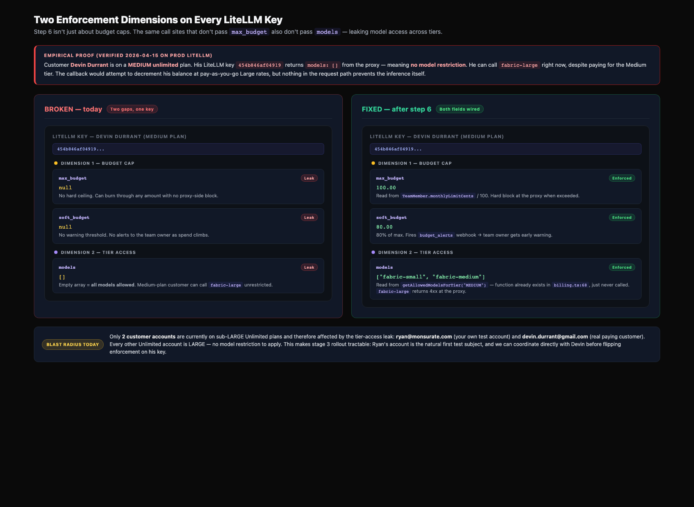
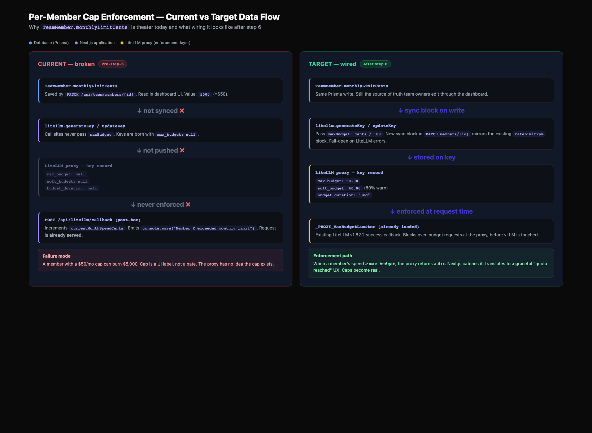
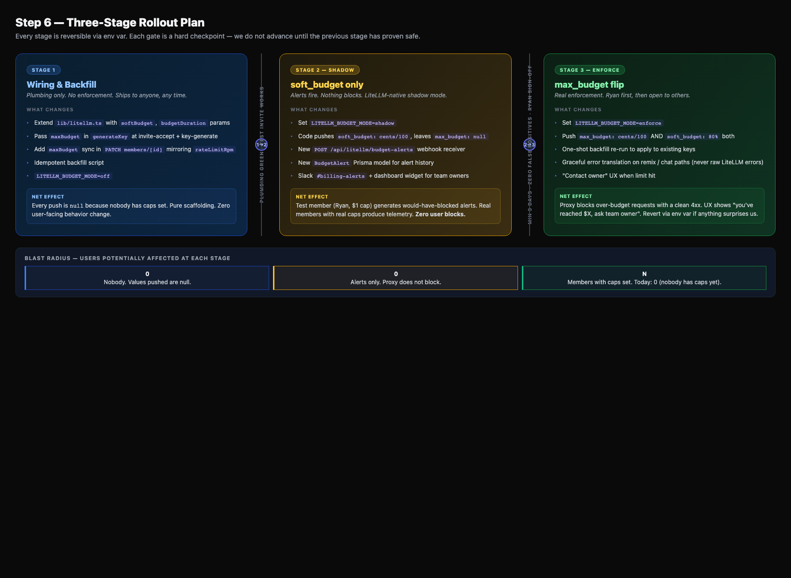
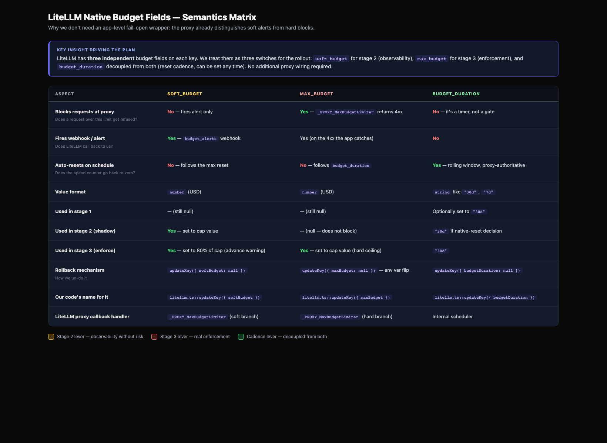
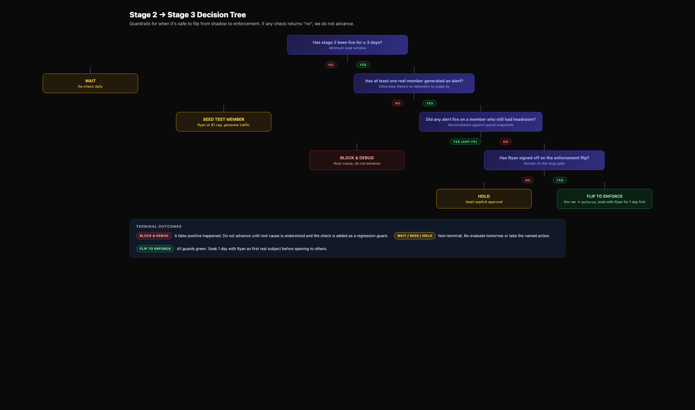
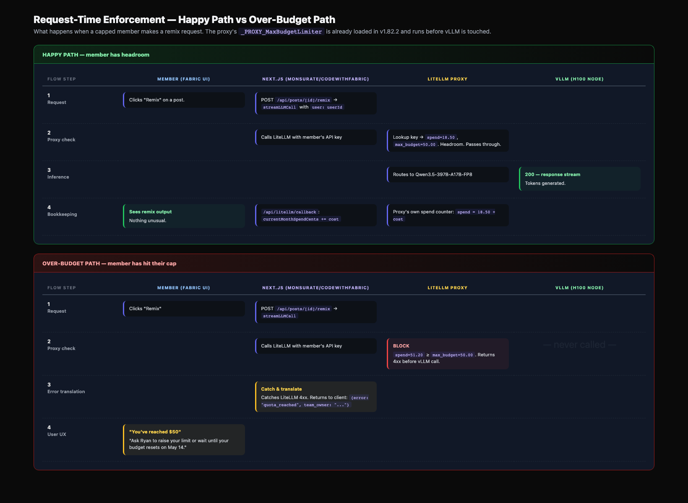
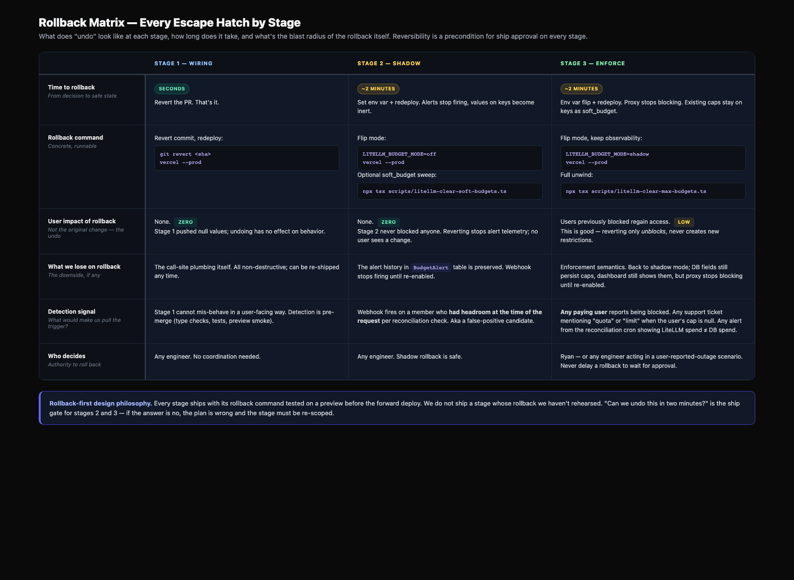

# Teams Billing — LiteLLM Enforcement Plan (Budget Caps + Tier Access)

> Step 6 of the [teams-billing architecture plan](./teams-billing-architecture-plan.md).
> Written: 2026-04-15. Status: DRAFT — awaiting Ryan approval before any code lands.
> **Scope expanded 2026-04-15** to also cover tier-access leak (see "Two enforcement dimensions" below).

## TL;DR

`TeamMember.monthlyLimitCents` is theater — it's saved, displayed, and logged post-hoc, but the LiteLLM proxy never learns about it. A member with a $50 cap can burn $5,000 and all they get is a `console.warn`. **Separately but through the same broken wiring**, every LiteLLM key is born with `models: []` meaning no tier restriction — a MEDIUM-plan customer can call `fabric-large` unrestricted. This plan wires BOTH gaps to LiteLLM's native enforcement (one pass through the same 3 call sites), with a three-stage rollout that uses LiteLLM's `soft_budget` field as the built-in shadow phase for budget enforcement and an app-level log-only branch for the tier-access shadow.

**Hard constraint (non-negotiable):** production has real paying users. We never ship a change that can false-positive block them. Every stage is reversible; the enforcement flip happens only after the shadow stage shows zero false-positive candidates.

## Two enforcement dimensions (scope expansion — 2026-04-15)



While investigating the budget-cap wiring, a second enforcement gap surfaced: **`billing.ts::getAllowedModelsForTier`** (line 68) is a complete helper that returns the correct per-tier model whitelist and whose own comment says *"used to restrict LiteLLM API keys at the proxy level"* — but the function is **never called anywhere**. Dead code. The intent was to wire `models: ["fabric-small", "fabric-medium"]` into `litellm.generateKey`/`updateKey` for MEDIUM-tier members, but that wiring was never completed.

**Empirically verified on prod (2026-04-15):**

```
user: devin.durrant@gmail.com  (unlimitedTier = MEDIUM)
key 454b846af04919:  models=[]  max_budget=None  soft_budget=None
```

Devin is on a Medium plan. His key has no model restriction and no budget cap. He can call `fabric-large` right now and the only response from our system is a post-hoc `shouldDecrementBalance` entry in the callback handler that tries to charge pay-as-you-go rates — the actual inference already happened. This is a leak, not a billing error.

**Blast radius today: 2 customer accounts on sub-LARGE Unlimited plans:**

- `ryan@monsurate.com` (Ryan — self, ideal first test subject)
- `devin.durrant@gmail.com` (real paying customer — coordinate directly before stage 3 flip)

Every other Unlimited account is LARGE, meaning no model restriction to apply.

**Why fold this into step 6 instead of a separate plan:**

- Same call sites — `litellm.generateKey`/`updateKey` already accept a `models: string[]` parameter, it's the same 2+1 locations as the budget wiring
- Same rollout shape — wire → shadow → enforce, same three stages, same env-var rollback
- Same constraint — "no false positives on paying users" applies identically
- Same infrastructure — LiteLLM proxy, same key records, same reconciliation cron
- The dead code (`getAllowedModelsForTier`) already exists. We are completing someone's half-built work, not inventing something new.

**The one asymmetry:** LiteLLM has no native "soft_models" analog to `soft_budget`. The tier-access shadow stage has to be app-level — extend `/api/litellm/callback` to detect "member called a model outside their tier", log a `BudgetAlert` row with `kind = TIER_LEAK`, and don't add a pre-request gate until stage 3. Budget caps and tier access use the same rollout gates but different shadow mechanisms.



## Current state (investigation, 2026-04-14)

**What works:**

- `TeamMember.monthlyLimitCents` persists via `PATCH /api/team/members/[memberId]`
- `TeamMember.currentMonthSpendCents` + `TeamMember.budgetResetAt` are incremented in the LiteLLM callback route (`src/app/api/litellm/callback/route.ts`)
- `lib/team-hierarchy.ts::checkAndResetBudget` handles monthly rollover DB-side
- Dashboard UI shows the cap + current spend per member

**What's broken (the whole point of this plan):**

- Key-generation call sites do not pass `maxBudget` to LiteLLM:
    - `src/app/api/team/invitations/[token]/accept/route.ts:77`
    - `src/app/api/keys/generate/route.ts:52`
- `PATCH /api/team/members/[memberId]` has a `rateLimitRpm` → LiteLLM sync block but **no** parallel `monthlyLimitCents` → LiteLLM sync
- The callback's over-limit detection is a `console.warn`, after the request has already been served
- All existing LiteLLM keys have `max_budget: null, soft_budget: null, budget_duration: null` (verified 2026-04-15 via `/key/list`)

**What the proxy already has (good news):**

- LiteLLM v1.82.2 on `69.30.85.97:8000` has `_PROXY_MaxBudgetLimiter` and `_PROXY_VirtualKeyModelMaxBudgetLimiter` loaded as success callbacks — budget enforcement is **already active**. Setting `max_budget` on a key blocks at the proxy.
- LiteLLM supports `soft_budget` (alert webhooks, no block), `max_budget` (hard block), and `budget_duration` (auto-reset cadence) natively on keys.
- `_PROXY_MaxBudgetPerSessionHandler` is also loaded if we ever want per-session limits.

**Blast radius today — budget dimension: zero.** The only team with members is Farpoint HQ (owned by `ryan@farpointhq.com`, 8 employee members added 2026-04-14). No one has `monthlyLimitCents` set. Stages 1 and 2 ship without affecting a single customer on the budget dimension. Stage 3 ships affecting nobody on budget until an owner explicitly sets a cap.

**Blast radius today — tier dimension: 2 customer accounts.** `ryan@monsurate.com` (self) and `devin.durrant@gmail.com` are on MEDIUM Unlimited. Their keys currently have `models: []` (unrestricted). Stage 3 on the tier dimension will affect exactly these 2 keys. Ryan is the natural first test subject; Devin requires out-of-band coordination before the flip.

## Architecture: three-stage rollout



Each stage is an independent PR, reviewed separately, with its own rollback path.

### Why soft_budget vs max_budget matters

The reason we don't need an app-level fail-open wrapper is that LiteLLM already distinguishes the two semantics at the proxy level. This is the core insight of the rollout shape:



### Stage 1 — Wiring & Backfill

**Goal:** the code learns to push budget values to LiteLLM, but every value it pushes during stage 1 is either `null` (no change) or matches what's already in the DB. No enforcement changes. This stage is deployable at any time; it cannot affect a single user.

**Changes:**

1. **Extend `lib/litellm.ts`** — `generateKey` and `updateKey` already accept `maxBudget` and `models`; add `softBudget`, `budgetDuration`, and `budgetResetAt` pass-throughs. Everything else is already in the signature.
2. **Wire `maxBudget` AND `models` at key generation** (two sites):
    - `src/app/api/team/invitations/[token]/accept/route.ts:77` — pass both:
      ```ts
      const tier = member.unlimitedTier ?? team.unlimitedTier;
      const models = tier ? getAllowedModelsForTier(tier) ?? undefined : undefined;
      await litellm.generateKey({
        userId, keyName, teamId,
        maxBudget: member.monthlyLimitCents != null ? member.monthlyLimitCents / 100 : undefined,
        models,  // undefined = no restriction (LARGE), array = restricted to named models
      });
      ```
    - `src/app/api/keys/generate/route.ts:52` — same pattern
    Both paths will, in practice, pass `undefined` for **budget** during stage 1 (nobody has caps), but **models** will begin taking effect for new Medium-tier keys minted after stage 1 ships. Since Medium-tier key generation is rare (2 accounts total, both already have keys), this is low-risk — but see the stage 1 shadow note below.
3. **Wire `maxBudget` AND `models` sync on update** — add a block in `PATCH /api/team/members/[memberId]` mirroring the existing `rateLimitRpm` sync around line 157. Triggered when `body.monthlyLimitCents` OR `body.unlimitedTier` changes:
    ```ts
    if (body.monthlyLimitCents !== undefined) {
      try {
        const apiKey = await prisma.apiKey.findUnique({ where: { userId: member.userId } });
        if (apiKey?.litellmKeyId) {
          await litellm.updateKey({
            key: apiKey.litellmKeyId,
            maxBudget: body.monthlyLimitCents != null ? body.monthlyLimitCents / 100 : null,
          });
        }
      } catch (error) {
        console.error("Failed to sync monthly limit to LiteLLM:", error);
        // Fail-open: the DB update already succeeded; log and move on.
      }
    }
    ```
    Fail-open: if LiteLLM is unreachable, the DB is still the source of truth and the next reconciliation pass fixes drift.
4. **Backfill script** — `scripts/backfill-litellm-enforcement.ts`:
    - For every `TeamMember` row: push `maxBudget` (if non-null) AND `models` (per current tier) to their LiteLLM key via `litellm.updateKey`.
    - For every `ApiKey` owned by a user whose team is Unlimited at a sub-LARGE tier: same.
    - Idempotent. Re-running is a no-op.
    - Today, the budget side of the script finds **zero rows** to update, but the models side affects **2 keys** (Ryan's and Devin's). **Critical:** running the backfill ships tier enforcement without the shadow phase unless we gate the models update on `LITELLM_BUDGET_MODE != off`.
5. **Important asymmetry in stage 1:** because `getAllowedModelsForTier("MEDIUM")` returns `["fabric-small", "fabric-medium"]`, any key we write with those models becomes *immediately enforcing* at the proxy — there is no `soft_models` field. We must NOT apply the models field during stage 1. Stage 1 wires the plumbing for models only at new-key creation for NEW users (of which there will be ~zero today, and any new signup won't have an Unlimited tier yet). Stage 1's backfill script is budget-only until stage 2.

**Ship criterion:** plan approved, PR green, preview test confirms key generation on a freshly-invited test member still works end-to-end (budget side is null, models side is null for a new user with no tier yet).

**Rollback:** revert the PR. No DB or LiteLLM state changes to undo since all the values we'd push during stage 1 are `null`.

### Stage 2 — Shadow (soft_budget only)

**Goal:** capture "would have blocked" telemetry without blocking. This is the observation window that proves we won't false-positive anyone in stage 3.

**Key insight:** LiteLLM's `soft_budget` field triggers `budget_alerts` webhooks when a key's spend crosses the threshold, **but does not block requests**. This is exactly the shadow behavior we want, and it's native — no app-level interception needed.

**Changes:**

1. **Flag-gated stage** — introduce `LITELLM_BUDGET_MODE` env var with values `off` (stage 1 default), `shadow` (stage 2), `enforce` (stage 3).
2. **Budget shadow (native):** when pushing a cap to LiteLLM, send `soft_budget: cents / 100` instead of `max_budget`. Leave `max_budget: null`. LiteLLM fires `budget_alerts` webhook, nothing blocks.
3. **Tier-access shadow (app-level, because no native analog):** leave LiteLLM key `models` field as `[]` but extend `/api/litellm/callback` to detect tier violations in the already-received usage records:
    ```ts
    // New branch in callback handler
    const effectiveTier = higherTier(team.unlimitedTier, member?.unlimitedTier);
    if (effectiveTier && !isModelCoveredByTier(model, effectiveTier)) {
      await prisma.budgetAlert.create({
        data: { memberId: member.id, teamId: team.id, kind: "TIER_LEAK",
                model, tierAtTime: effectiveTier, stage: "SHADOW" }
      });
      // Also Slack notify
    }
    ```
    This fires a row (and Slack message) when a Medium-tier user calls fabric-large — but the request has already succeeded. It's logging-only, exactly what we want from shadow mode.
4. **Wire the `/api/litellm/budget-alerts` webhook** (new route) to receive soft-budget alerts from LiteLLM. Store each alert in the same `BudgetAlert` table with `kind = "BUDGET_SOFT"`.
5. **New `BudgetAlert` Prisma model:**
    ```prisma
    model BudgetAlert {
      id             String   @id @default(cuid())
      kind           AlertKind  // BUDGET_SOFT | BUDGET_HARD | TIER_LEAK
      stage          String     // SHADOW | ENFORCE
      memberId       String?
      teamId         String
      keyHash        String?    // last 14 chars of LiteLLM key token
      model          String?    // tier-leak: which model was called
      tierAtTime     String?    // tier-leak: what tier they had
      spendCents     Int?       // budget-soft: how much they'd spent
      thresholdCents Int?       // budget-soft: what the cap was
      firedAt        DateTime @default(now())
    }
    enum AlertKind { BUDGET_SOFT BUDGET_HARD TIER_LEAK }
    ```
6. **Dashboard widget** — "Members approaching / over their monthly limit" and "Members calling off-tier models" with alert history. Team owner only. Read-only.
7. **Shadow criterion for flipping to stage 3:** N days (see **Open decision 1**) with:
    - At least one member having a real budget cap set, producing zero budget false positives, AND
    - At least one member on a Medium tier actually generating a `TIER_LEAK` alert (for tier), or Ryan confirming via manual test
    - "False positive" = an alert fired on a request where the reconciliation check says the member still had headroom / was actually allowed that model at the time of the request.

**Test member:** Ryan opts in as the first test subject. Cap a dummy `ryan-shadow-test@example.com` user at $1, run some deliberate remix traffic through his key, verify the alert webhook fires, verify no request is blocked. Remove the cap before moving to stage 3. (See **Open decision 3**.)

**Ship criterion:** one test member exercised the alert path successfully + N days of real traffic on whichever members actually have caps set (which is zero today → we have to seed a test case).

**Rollback:** env var `LITELLM_BUDGET_MODE=off` and redeploy. soft_budget values are harmless (they don't block), but we can clear them via a one-shot "unset soft_budget everywhere" script if desired.



### Stage 3 — Enforce (max_budget flip)

**Goal:** actually block over-budget requests at the proxy.

**Changes:**

1. **Env flip:** `LITELLM_BUDGET_MODE=enforce`. From now on, every push sends:
    - `max_budget: cents / 100` (hard ceiling)
    - `soft_budget: cents / 100 * 0.8` (80% early warning)
    - `models: getAllowedModelsForTier(tier) ?? undefined` (tier restriction — `undefined` for LARGE, array for MEDIUM/SMALL)
2. **Backfill-in-place migration:** re-run `scripts/backfill-litellm-enforcement.ts` — this time with models enabled. Touches **exactly 2 keys** in prod today: Ryan's and Devin's. Both Medium-tier.
    - **Order of operations** (critical for avoiding false positives):
        1. Coordinate with Devin out-of-band ("we're enforcing tier access tomorrow — let us know if you've been using fabric-large and want to upgrade")
        2. Run backfill against Ryan's key first (self-test)
        3. Run backfill against Devin's key only after Ryan's key is verified working
        4. 24-hour soak, watch Slack for any support tickets
3. **Error handling in the remix / chat paths:** when LiteLLM returns the over-budget OR off-tier error (need to verify exact error shapes — see **Open decision 2**), catch and translate:
    - Budget exceeded: *"You've reached your monthly $X limit. Contact your team owner to request more."*
    - Model not allowed: *"Your plan includes fabric-medium but not fabric-large. Upgrade to Large or use a covered model."* + link to billing page
4. **Dashboard UX:**
    - Member hitting budget cap: "Over limit — contact owner"
    - Member hitting tier restriction: "Your plan doesn't include this model" + upgrade CTA
    - Team owner: alert inline with raise-limit / upgrade-tier buttons

**Ship criterion:** stage 2 telemetry clean for both budget AND tier alerts; explicit Ryan sign-off; first enforcement target is Ryan's own `ryan@monsurate.com` Medium key for a one-day soak before applying to Devin's key.

**Rollback:** env flip to `LITELLM_BUDGET_MODE=shadow` + run `scripts/litellm-clear-enforcement.ts` which removes both `max_budget` and `models` restrictions from all keys (leaving `soft_budget` intact for observability). Reverts enforcement in minutes on both dimensions simultaneously.

### Request-time enforcement — what actually happens when a member's cap is hit



## Budget reset model: native `budget_duration` vs DB-side

LiteLLM supports `budget_duration: "30d"` which auto-resets the key's spend counter 30 days after the last reset. This is cleaner than the current DB-side `checkAndResetBudget` logic — the proxy handles it. **Open decision 4.**

**Recommendation:** use native LiteLLM `budget_duration: "30d"`. Pros:

- One less moving part in the callback handler
- DB-side `currentMonthSpendCents` + `budgetResetAt` become a reporting mirror, no longer load-bearing
- LiteLLM spend is authoritative

Cons:

- Reset cadence is rolling-30-days per key, not calendar-month. If you want calendar-aligned billing cycles (the 1st of every month), we stick with DB-side reset and call `litellm.updateKey({ key, spend: 0 })` on rollover.

This is Open decision 4 below.

## Call-site map

| File | Line | Change | Stage | Dim |
|------|------|--------|-------|-----|
| `src/lib/litellm.ts` | 84-119 | Extend `generateKey`/`updateKey` with `softBudget`, `budgetDuration` params | 1 | $ |
| `src/app/api/team/invitations/[token]/accept/route.ts` | 77 | Pass `maxBudget` + `models` (gated by mode) | 1 → 2 → 3 | $ + tier |
| `src/app/api/keys/generate/route.ts` | 52 | Same | 1 → 2 → 3 | $ + tier |
| `src/app/api/team/members/[memberId]/route.ts` | ~157 | New sync block for `monthlyLimitCents` AND `unlimitedTier` changes (triggers `models` re-sync) | 1 | $ + tier |
| `src/app/api/litellm/callback/route.ts` | 209-244 | Leave budget path alone in stage 1. **Stage 2**: add tier-leak detection branch using `isModelCoveredByTier`. **Stage 3**: translate proxy over-budget / off-tier errors if they arrive here. | 2, 3 | tier shadow, $ + tier enforce |
| `src/app/api/litellm/budget-alerts/route.ts` | NEW | Webhook receiver for LiteLLM `budget_alerts` (soft_budget fires) | 2 | $ |
| `src/lib/litellm.ts` | — | New `budgetMode()` reading `process.env.LITELLM_BUDGET_MODE` | 2 | both |
| `src/lib/billing.ts` | 68 | Existing `getAllowedModelsForTier` — now actually called from the generate/update sites | 1 (stub), 3 (live) | tier |
| `scripts/backfill-litellm-enforcement.ts` | NEW | Idempotent backfill for BOTH budget and models | 1 (budget only), 3 (+ models) | $ + tier |
| `scripts/litellm-clear-enforcement.ts` | NEW | Rollback script — clears both fields | rollback | $ + tier |
| `prisma/schema.prisma` | NEW model | `BudgetAlert` table with `kind: BUDGET_SOFT | BUDGET_HARD | TIER_LEAK` | 2 | both |

## Testing approach

- **Stage 1:** unit test the `litellm.ts` parameter pass-through. Integration test on preview Vercel: invite a throwaway user, accept the invite, verify `litellm.generateKey` is called with the expected args (assertion via a mock or by calling `/key/info` on the preview LiteLLM — preview shares prod LiteLLM, so carefully).
- **Stage 2:** end-to-end shadow test:
    1. Create a `ryan-shadow-test@example.com` user with a real LiteLLM key
    2. Set `monthlyLimitCents = 100` ($1)
    3. Run 3-4 remix calls totalling ~$0.50 → no alert
    4. Run more calls totalling > $1 → `BudgetAlert` row inserted, Slack message fires, **no request blocked**
    5. Remove the cap, clean up the user
- **Stage 3:** same as stage 2 but the last step is "call is blocked with HTTP 402 and the UX shows the contact-owner message". First run against Ryan, then open up.

## UX copy (draft)

- **Member over soft limit (80% of cap):** none to the member; alert only to team owner.
- **Member over hard limit:** *"You've used $X of your $Y monthly limit. Ask [Owner Name] to raise your limit or wait until your budget resets on [date]."*
- **Team owner alert (Slack or dashboard):** *"[Member] is at 80% of their $Y monthly cap ($X spent). [Raise limit] [View usage]"*
- **Team owner when member is at 100%:** *"[Member] has reached their $Y monthly cap. They cannot make new requests until [reset date] or you raise their limit."*

## Rollback paths — every escape hatch by stage



## Risks & mitigations

| Risk | Likelihood | Impact | Mitigation |
|------|-----------|--------|------------|
| Stage 3 blocks a paying user with headroom due to clock skew or stale spend data | Low | **High** (support fire, refund) | Shadow phase proves this doesn't happen before enforcement. Keep stage 3 reversible via env var. |
| LiteLLM proxy returns an unexpected error shape on over-budget | Medium | Medium | Stage 3 work includes a `try/catch` around every remix/chat path that translates any LiteLLM 4xx to a graceful "quota reached" UX, with the raw error logged for ops. |
| `budget_duration` drift: rolling 30d doesn't match expectations | Medium | Low | Document explicitly. Open decision 4 picks the resolution. |
| `TeamMember.monthlyLimitCents` and LiteLLM `max_budget` drift over time | Medium | Medium | Reconciliation script (part of backfill) runs weekly via cron to push DB → LiteLLM. Read-only reverse check compares LiteLLM spend to `currentMonthSpendCents` and alerts on drift. |
| Cap set for member who doesn't yet have a LiteLLM key | Low | Low | PATCH handler just skips the LiteLLM sync (`if (apiKey?.litellmKeyId)`); the value lands in DB, and when the member generates their first key, stage 1 key-generation code picks it up. |

## SOLID analysis

- **S (Single Responsibility):** the `litellm.ts` wrapper stays focused on LiteLLM API calls. Budget-mode logic is a single helper (`budgetMode()` reading env). The webhook handler is one file doing one thing. ✓
- **O (Open/Closed):** adding a new stage (e.g., a hypothetical "per-model enforcement") is a new branch in `budgetMode()` + a new DB column, not a rewrite. ✓
- **L (Liskov):** N/A — no subclassing.
- **I (Interface Segregation):** `litellm.ts::generateKey` is growing parameters; we keep them optional so existing call sites aren't forced to know about budget mode. ✓
- **D (Dependency Inversion):** the PATCH handler depends on `litellm` (concrete module). Could abstract to an `IBudgetSink` interface, but that's over-engineering for one consumer. Skip. ✓

## Open decisions (need Ryan input before implementation)

1. **Shadow phase duration.** How many days should stage 2 run before we flip to stage 3? Options: 3 days (aggressive, given zero real caps in production today), 7 days (conservative), or "until at least one real member has a cap and hits it without false positives" (event-driven). My lean: **event-driven + min 3 days**, because today there's nobody to shadow.

2. **Over-budget error shape.** I need to actually trigger a max_budget over-limit on a test key and capture LiteLLM's exact error response. Can do this during stage 1 implementation, before stage 3 lands. Not a blocker for plan approval.

3. **Test member identity.** Is it OK to create `ryan-shadow-test@example.com` as a throwaway test user on prod (same pattern as step 4)? Alternative: use your `ryan@monsurate.com` member row on Fabric HQ's team, set a $1 cap, test, remove. Cleaner but touches a real account.

4. **Budget reset model.** Native LiteLLM `budget_duration: "30d"` (rolling, simpler, proxy-authoritative) vs DB-side calendar-month reset (current `checkAndResetBudget` logic, calendar-aligned, two sources of truth). Recommendation: **native**.

5. **Stage 2 ship timing.** Stage 1 alone is safe-to-ship-anytime. Should we land stage 1 standalone first, then come back for stage 2 later? Or batch stages 1+2 into one PR cycle since they're both non-enforcing? Recommendation: **stages 1+2 in one cycle, stage 3 as a separate PR with its own review.**

## Timeline (once decisions are made)

- Stage 1 + 2: ~1 day of focused work (plumbing + webhook + backfill script + shadow env var + one dashboard widget)
- Shadow phase observation: 3-7 days (see decision 1)
- Stage 3: ~half day of focused work (env flip + error translation + UX copy) + 1 day soak with Ryan as first subject
- **Total calendar time: ~1 week** from plan approval to full enforcement, gated on shadow-phase observation

## Appendix — verification commands

```bash
# LiteLLM proxy health (confirms MaxBudgetLimiter is loaded)
curl -s -H "Authorization: Bearer sk-farpoint-litellm" http://69.30.85.97:8000/health/readiness | jq .

# Inspect a key's current budget fields
curl -s -H "Authorization: Bearer sk-farpoint-litellm" "http://69.30.85.97:8000/key/info?key=<key>" | jq .

# List keys with non-null max_budget (sanity check during rollout)
curl -s -H "Authorization: Bearer sk-farpoint-litellm" "http://69.30.85.97:8000/key/list?return_full_object=true&size=200" \
  | jq '.keys[] | select(.max_budget != null) | {user_id, max_budget, spend, soft_budget}'
```
